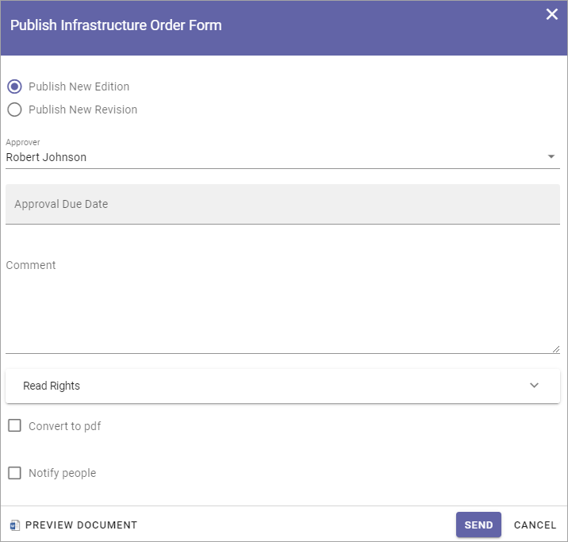
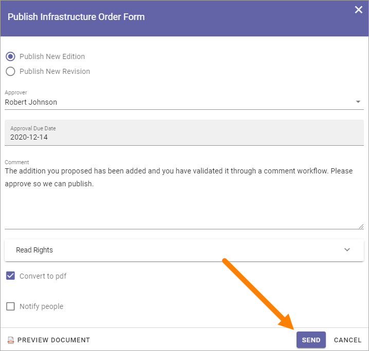

Publish - The Approval Workflow
================================

When a document has reached a final version, the document must be published, and, if approval is activated, be approved for publication, to be available for readers. To do that, you start an Approval Workflow.

All metadata must be properly set before the Approval Workflow is started, so the document for example will be available in the right lists. Some metadata can be mandatory. If all mandatory metadata has not been added, the Approval Workflow can not be started.

**Note!** Metadata can also have impact on who is available as approver.

Any Send for Comments Workflow must be ended before an Approval Workflow can be started.

To publish a document, do the following:

1. Make sure no Send for Comments workflow is active for the document.
2. Check that all metadata (Properties) are correct.
3. Select the document.
4. Open the dot menu and select "Publish".

.. image:: approval-1-new3.png
 
Something like the following is shown:

.. image:: approval-2-new3.png

Exactly which options are available here depends on a a number of settings. These are the common ones:

+ **Merge with document template**: If the document is not merged with a template, it can be done now. If the document already is merged with a template, this is not shown. If you select "Yes", open the list and select a template.
+ **Publish New Edition/New Revision**: When a document has been published at least once, and if the settings allowed it, you can choose to publish a new revision instead (see example below). A revision is a much simpler update, for example to fix some typing errors, and does not require approval. If revisions is not allowed, only Publish New Edition is shown.
+ **Approver**: You select one approver from the list, or accept the suggested. Available approvers depends on various settings and how the system is set up.
+ **Approval Due Date**: Here the author adds a date when the approval should be made, at the latest. This is just information for the approvers. The Approval workflow is not stopped if this date is pased.
+ **Comments**: Use this field for comments about what was edited/added in a new edition. The field is not shown when the first edition is published.
+ **Read rights**: This sets the read permissions when the document is published. The default selection is to use the Default Readers Group from the site’s permissions. If, for some reason, the Read Rights for this particular document should be different, you can select "Limit Read Access", and enter the names of the readers, or any group memberships, for example AD groups.
+ **Convert to PDF**: An administrator can set how this will work, in Omnia Admin, and it can be different for each Document Type – it can be available or not available. Conversion to PDF is only available for docx, pptx and xlsx documents. A preview of the PDF doucment is available through the link "Preview document".
+ **Notify people**: You can use this option to notify certain people or groups about the new edition of the document. The notification is sent when the document is approved. You can find more information about notifying people on this page: :doc:`Read and understood - Notify and Read Receipt</working-with-documents/authoring-controlled-documents/read-and-understood/index>`
+ **Require Read Receipt**: When notifying people, you can also select this option for read receipts to be sent to this Controlled Documents library.
+ **Preview Document**: Click here to see a preview of how the approver will see the document, converted to PDF or not.

Here's an example when a document has been published before. "Publish New Revision", if allowed, can now be an alternative for simpler updates.

5. Select template if needed, and select all other necessary options.
6. Click "Send".

When you click "Send", a task is created for the approver, and an e-mail is sent, with a link to the document. The task can look like this:

.. image:: approval-task-new3.png
 
The approver automatically has read access to the document (Note! Read access only!), until the task is completed. If a Notification Panel is set up for Tasks, the approver is also notified in the notification panel, and can choose to open the task from there. 

The workflow will be active until the task is completed and the document will be locked for editing during that time.

Approved or Rejected
*********************
If the document is approved for publication, it’s now available for readers. You, the author, will receive an email stating that.

If it’s rejected, there’s some changes the approver would like you to do. You will receive an email stating that the document was rejected and a message from the approver. After changes has been made, you start a new Approval Workflow the same way as before.
