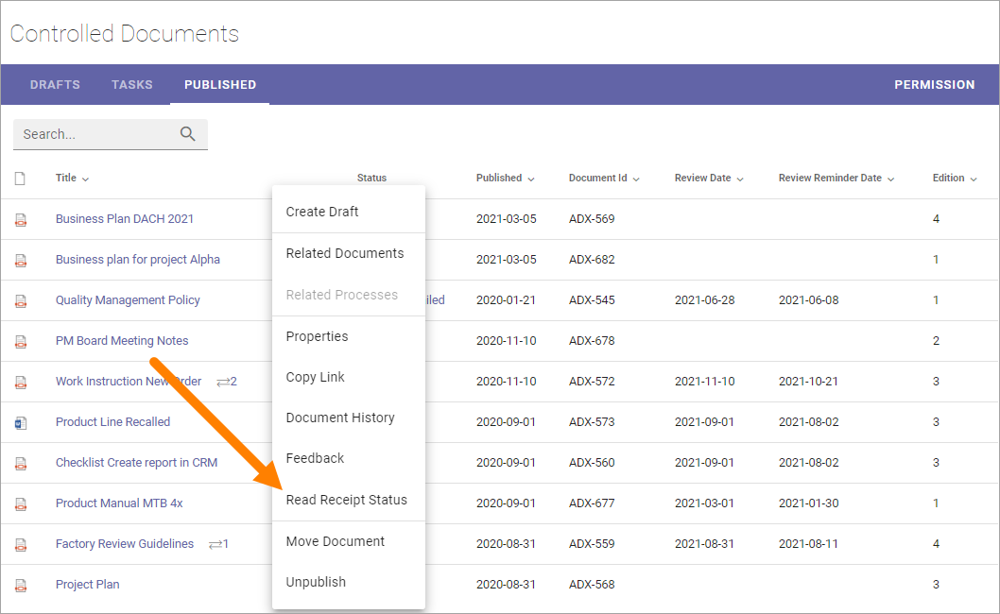

Read and understood - notify and read receipt
===============================================

When a controlled document is published, you can choose to send a notification to some users, and when doing so, can also choose to receive read receipts, to make sure the notification has reached them. The notifications are sent when the document is approved for publishing.

Note that, in Omnia 7.7 and later, you can also use sign-off requests for controlled documents. You then have a lot more options making sure colleagues are aware of important documents and updates.

For more information, see: :doc:`Sign-off requests </admin-settings/tenant-settings/sign-off-requests-613/index>`

Sending notifications is always voluntary. The decision is made when the document is published. If any colleagues should be notified of the new edition, select "Notify people" and add people or groups to the field.

.. image:: notify-people-new2.png

Some notes on using groups for notifications:

+ SharePoint groups and AD groups can be used (Microsoft 365 groups can not).
+ Regarding	SharePoint groups: Only SharePoint groups within the active site collection can be used. There can not be an AD group defined in the SharePoint group.
+ Regarding AD groups (Security groups): The AD group must be Email enabled. Read receipts can not be used for AD groups.

To make sure recipients has received the notification, you can select "Require read receipt". (Also see above regarding AD groups.)

.. image:: read-receipt-new2.png

Check read receipt status
***************************
Read receipt status can be checked for a document on the "Published" tab, this way:

1.	Click the dot menu for the document.
2.	Select "Read receipt status". 

3. Select the edition to check.

A list of those that has received a notification with read receipt request is now displayed, their e-mail address and the status are shown. Here's an example:

.. image:: read-receipt-status-notread-new.png
 
A green dot means that the recipient has read the message, a red that he or she has not.
