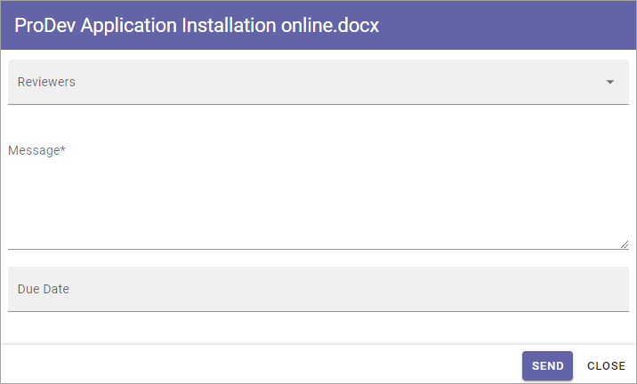
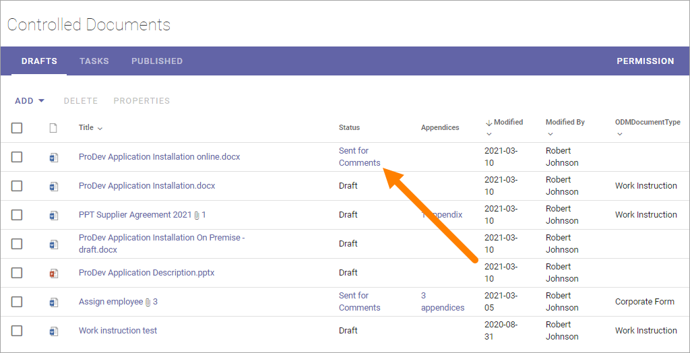

Send a draft for comments
========================================

Authors can use the send for comments workflow to get input from one or more colleagues in an organized way, or even to get help to type some part of the text. When the Workflow is active, all users that has been added as reviewers can edit the document, regardless of what access they normally have to the site. If it’s a Microsoft Word document; the option “Track changes” is automatically turned on so all comments/changes can be seen by everyone.

The option can be run as many times as needed before the publishing of an edition, but there can only be one such workflow active at a time, for each document. On the other hand, using this workflow is optional. You, the author, can always choose to publish directly. 

**Note!**
Everyone that is appointed as reviewer automatically receives edit access to the document when the workflow is active, and that access is removed when the colleague’s task is completed. Also note that publication is not allowed while a send for comments workflow is active for the document.

To start the workflow, do the following:

1. Select the document.
2. Open the dot menu and select "Send for comments".

.. image:: send-for-comments-1-new3.png

The following is shown:

+ **Reviewers**: Here, all colleagues to send to (=appoint as reviewers) is added. Normally, any colleague can be added here. 
+ **Message**: A message to the reviewers is added here. Note that you can only use one message even if you send to several reviewers. 
+ **Due date**: A date when the review should be finished is entered here. The workflow will be active until the due date of the workflow is reached, all tasks are completed or the workflow is cancelled by the author.

Note that all fields are mandatory.

3. Add reviewers, a message and due date.
4. Click "Send".

A task is now created for each colleague, and an Email is sent to each, with the message entered, and with a link to the document. **General note**: For a user to be able to receive Emails, the acccount must be email enabled.

Reviewers can also be notified in the notification panel about the new task, if it's set up to display tasks, and can choose to open the task from there. 

Check status and cancel a send for comments workflow
*******************************************************
In the column "Status" you can see what's going on with a document. You can also use that column to check status for a send for comments workflow, meaning who has reviewed and who has not. You can also cancel a workflow if needed. Do the following:

1. Click "Sent for comments" in the "Status" column.

Something like the following is shown:

.. image:: check-cancel-2-new3.png

Here you can see the due date noted for the workflow and on a row for each reviewer you can see if her or she has reviewed yet and the comment, if the review was done.

You can cancel a send for comments workflow any time. The reviewers will be notified if you do.

To cancel, do the following:

1. Click "Cancel workflow".

.. image:: check-cancel-3-new3.png

You can also check status for both send for comments workflows and publish workflows on the Tasks tab, See this page for more information: :doc:`Working with tasks </working-with-documents/authoring-controlled-documents/working-with-tasks/index>`

More on how the review reminder works
-----------------------------------------
If a new edition/revision of a controlled document is published or the published document is deleted, any associated review reminder task will be automatically completed. If the review is completed, the review comment will be added to the document history and a new review date will be calculated based on the review reminder rule set on the document type.

See workflow history for a draft
***********************************
A workflow history is available for all draft documents, showing all finished or cancelled workflows for THIS draft version. Do the following to see workflow history:

1. Select the document.
2. Open the dot menu and select "Workflow history".

.. image:: workflow-history-new3.png

Something like the following is shown:

.. image:: workflow-history-shown-new.png
 
Click the workflow to see the details, for example:

.. image:: workflow-history-shown-details-new.png
 
 
