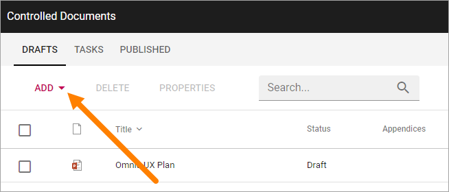

The Controlled Documents Library
====================================

(**This documentation is ongoing. Not ready for reading yet. Please come back later.**)

When a Team Site has been set up for Controlled Documents authoring, the following will be available for Controlled Document authors:

+ A documents library (Controlled Documents) that only users defined in the author’s permission group can work with.
+ A Send for Comments Workflow.
+ A Publish Workflow.
+ A Tasks list.
+ Workflow History.
+ Document History for drafts.
+ Document History for the published editions.
+ Options for relating to other documents.
+ Options for relating to QMS Processes (if Omnia QMS is activated).
+ Options for creating a new draft from a published document.
+ Options for unpublishing a published document.

In a Team Site set up for Conmtrolled Documents authoring a library, usually called just "Controlled Documents" is present:

.. image:: controlled-documents.png

In the Controlled Documents library, authors can find three tabs:

.. image:: controlled-documents-library-1-g2.png

"Drafts" is used when creating and editing drafts for new Controlled Documents or when updating an existing document for a new edition. Note that there are several options available for creating a new draft document, see below.

"Tasks" is a list of tasks for the documents – either for review or for publication – both active and finished.

When a document is published (approved for publication) it is removed from Drafts and is available on the "Published" tab. Here the options for creating a new draft, unpublishing and Document History are available.

Most headings can be used to sort the list.

Creating a draft document
**************************
When adding documents to a Controlled Documents library the author can either create a new draft or upload a document. If it’s a Controlled Document the author will actually work with here, a document should normally be created from scratch. If it’s a document that will be used as it is, for example as an appendice, it makes more sense to upload the document.

Creating a new draft document
----------------------------------
Do the following to create a new Controlled Document:

1. Click "Add" and select "New".

.. image:: new-controlled-document-2.png

The Create New Document Wizard starts and you use ut to create the document. See this page for information on how to use the wizard: 

Uploading documents
--------------------
An alternative is to upload an existing document, but normally it should be used just for documents that will be added as they are, but will still be handled as Controlled Documents, for example with approval before publishing.

A Document Type has to be selected for an uploaded document and the document has to be tagged with the required metadata, or he document can't be published.

The template for the Document Type is not used for the first edition of the document, the document will be used with the exeisting template (of any). The next time a draft is created for an uploaded document, the template can be altered, if needed.

To select Document Type and add metadata, use the option "Properties" in the document's menu, after the document has been uplodade.

Upload Appendices
------------------
To upload documents to use as appendices to another document, the main upload option should not be used.

Note that status must be "Draft" for the option to be available. If a document is sent for comments or for approval, appendices can not be uploaded to that document. Also note that a Document Type contains a setting that states if appendices are allowed or not. For a document tied to a Document Type with appendices not allowed, the Appendices option is not available (gray).

1.	Open the dot menu for the document to add appendices to, and select "Appendices".
2.	Click "Upload" in the window shown.

.. image:: upload-appendices-1-new.png
 
3.	Drag and drop one or more documents to the upload window.
4.	Click "Upload Files" to start the upload.
 
When the upload is finished the file(s) is visible in the Appendices list for the document, for example:

.. image:: upload-appendices-2-new.png
 
"Edit" can be used to edit the content of the appendix, if the file format is editable. "Rename" can be used to change the document's name. Use "Delete" to remove an appendix from this list.

Appendices can be added to this list continuously up to publication of the document. If appendices needs to be removed or added for a published document, a new edition of the document must be published.

**Note!** An appendix uploaded as shown above will not be visible in the Drafts list, but will only exist as a part of the main document. When a document with appendices is published, both the main document and the appendices are approved in one go. The appendices does not have to be approved separately (but also see below).

Published documents as Appendices
-----------------------------------
Another option is to add a copy of a published document as an Appendice. It must be a document that is published in this Controlled Documents library.

**Note!** In this case it is a copy of a document that will be added. There is no link between the published document and the copy, so if a new edition of the Appendice document is published, the copy used as an appendix is NOT updated.

1.	Open the dot menu for the document where you want to add appendices, and select "Appendices".
2.	Click "Copy from other Document" in the window shown.

.. image:: upload-appendices-3-new.png
 
3.	Search for the document. 
4.	Select the documents to add (a copy of) as appendices and click "Copy", for example:

.. image:: upload-appendices-4-new.png
 
The documents added to the Appendices list this way is handled exactly the same way as a document uploaded as an appendix, see above. (And remember that it is a copy of the original document.)

Creating a new draft from a published document
***********************************************
The work on a draft for a new edition of a document can be started whenever it’s convenient. The existing published edition is still available for readers until it’s replaced, when the new edition is published.

To create a new draft of a published document, do the following:

1.	Open the "Published" tab.
2.	Click the dot menu for the document.
3.	Select "Create Draft".

.. image:: create-new-draft-1-new.png

The new draft is created and the "Drafts" tab is automatically activated. The work on the new draft is done exactly as the first time. That a dokcument has been published before does not make any difference.

**Note!** There can be only one draft of a given document. If there already is a draft for the document and an author tries to create another on, a message is shown stating that it's not possible. 
 
New drafts and templates
-------------------------
If there is a new version of the template used for the document, the author will be notified and can choose to use the new version of the template, or stick to the old one.

A special case is when a new draft is created from a Word or Excel document that was uploaded rather than created from scratch. When a new draft for a second edition is created, the template can be altered (or rather selected). But using a template for an uploaded document is never mandatory, the document can always be used as is.

When selecting a template for an uploaded document, it’s always a good idea to use the preview to make sure the selected template actually works for the document.

If a template is selected, this document is from now on related to the template the same way as when a new document is created from scratch on the "Drafts" tab.

Even if a template is not selected for the second edition, the author gets a new chance the next time a new draft is created.

More useful Options for a published document
********************************************
There are some more useful options for a published document, you can for example check the Properties, see the Document History, see Feedback that users has sent and Move a document.

Checking a documents properties
-----------------------
The properties for a published document can be checked this way:

1.	Click the dot menu for the document.
2.	Select "Properties".
 
The Properties window for the document is shown, for example:

.. image:: document-properties-new.png
 
The properties can not be edited here. The properties can only be edited when working on a new edition of the document.

Document History
------------------
There’s information about each published edition available. To see it, do the following:

1.	Click the dot menu for the document.
2.	Select "Document History".
 
Here’s an example:

.. image:: document-history-new.png
 
You can see the publication date for each edition, the author’s comment, if any, and who the document was approved by. The option "Workflow History" for an edition will show information about when workflows was used and the comments entered during the workflows, so here you can even see information from Send for Comments workflows used for the document.

Check Feedback
--------------
Any user can send feedback on a published document and that feedback is available for authors here. The read feedback for a document:

1.	Click the dot menu for the document.
2.	Select "Feedback".
 
The feedback posts for the document is shown. You can click the dust bin to delete the feedback when you have read it, or keep it for later reference, it’ sup to you.

Move a document
----------------
A published document can be moved to any other site with a Controlled Documents library. If a draft for a new edition of the document is present, the draft must first be deleted.

**Note!** You must first check and note (or copy) the URL to the site you want to move the document to.

1.	Click the dot menu for the document.
2.	Select "Move Document".
 
The following is shown:

.. image:: move-document-new.png
 
3.	Type the URL (or paste, if you have copied it) to the site in the top field and click "Resolve". If the URL is correct the site title is shown in the second field.
4.	Click "Move".