Working with Drafts
====================================

"Drafts" is used when creating and editing drafts for new Controlled Documents or when updating an existing document for a new edition. Note that there are several options available for creating a new draft document, see below.

When a document is published (approved for publication if that is needed) it is removed from Drafts and is available on the "Published" tab. 

Most headings in the Drafts list can be used to sort the list.

Creating a draft document
**************************
When adding documents to a Controlled Documents library the author can either create a new draft or upload a document. If it’s a Controlled Document the author will actually work with here, a document should normally be created from scratch. If it’s a document that will be used as it is, for example as an appendice, it makes more sense to upload the document.

Creating a new draft document
----------------------------------
Do the following to create a new Controlled Document:

1. Click "Add" and select "New".

.. image:: new-controlled-document-1-new4.png

.. image:: new-controlled-document-2-new4.png

Creating new documents can be set up in different ways. A very common setting is to use the Create New Document Wizard. See this page for information on how to use the wizard: :doc:`Using the Document Wizard </working-with-documents/using-the-document-wizard/index>`

Upload documents
---------------------
An alternative is to upload existing documents, but normally it should be used just for documents that will be added as they are, but will still be handled as Controlled Documents, for example with approval before publishing.

The template for the Document Type is not used for the first edition of the document, the document will be used with the existing template (if any). The next time a draft is created for an uploaded document, the template can be replaced, if needed.  See *Edit a document's properties* below for more information.

Do the following to upload a document:

1. Click "Add" and select "Upload".

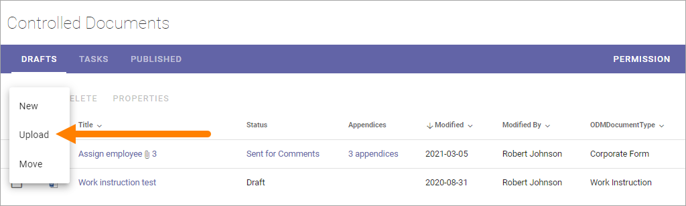

2. Use drag and drop or click "Browse" to select one or more documents to upload.

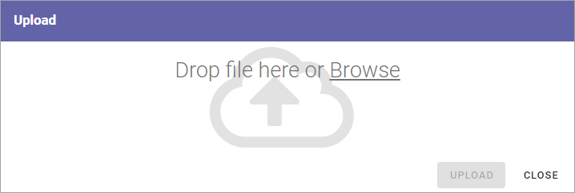

3. If you selected a document by mistake, just point at the file name and click the x to remove it from the list.
4. If you need to edit a file name, just click and enter a new one.
5. Click "UPLOAD".

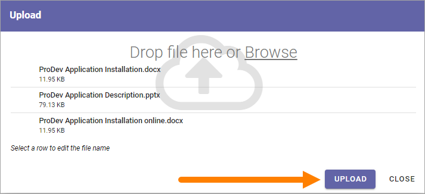

Edit a document's properties
*****************************
You may need to edit a document's properties before publishing, if you uploaded a document, or if any of the properties needs to be changed for a draft. Note that a document's properties can't be changed for a published document. You always have to publish a new edition of a document to be able to change properties.

Do the folllowing:

1. Select the document and click "Properties".

.. image:: edit-properties-1-new5.png

If this option is not shown you can open the dot menu for the document and select "Properties" there.

If you are doing this for an uploaded document that is not connected to a template you can now select template. (This is not shown for a document that already has a template tied to it, see below).

2. Select language if needed, to see the correct list of templates.

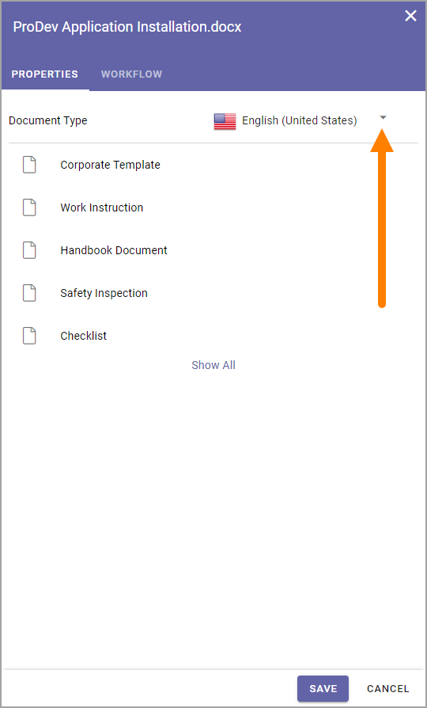

3. Select a template to connect to the uploaded document. To see a list of all available templates, click "Show All".

Now properties for the document are shown (and this is what is shown for a document you have created). It differs depending on the template (or rather the Document Type the template belongs to). Here's an example:

.. image:: edit-properties-2-new3.png

**Note!** You can even choose another template for the document here, if needed. Click the x for the existing template and select another template. Don't forget to select language if needed.

**Note!** A term that has been translated in the term store will be shown in the document's language here, but if the term is shown in the Drafts list, it is shown in the user's language. Also note that placeholders in DOCX and XLSX are replaced with terms based on the document's language.

3. Edit the properties as needed and save.

Move a document
************************
You can move a document, or several if you like, from any other Documents library in this Team Site, to the Controlled Documents library, and thus make them a Controlled Documents Draft.

Do the following:

1. Click "Add" and select "Move".

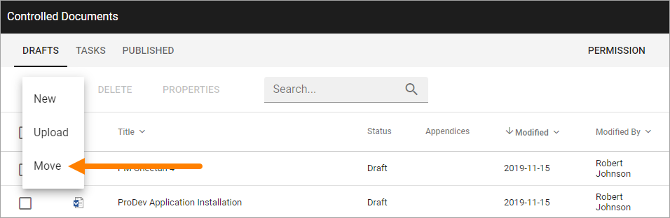

2. Open the library.

.. image:: draft-move-2-new4.png

3. Open a folder if needed.
4. Select one or more documents to move.
5. Click "GET DOCUMENT".

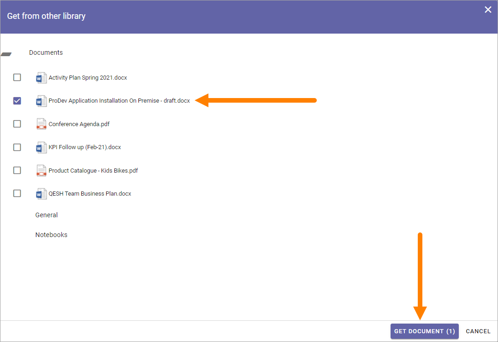

Now the selected document(s) are moved from the original Documents library and into the Controlled Documents library as drafts.

Recycle bin for drafts
**************************
In Omnia 7.0 and later there's a recycle bin available for deleted drafts. You delete a draft document the same way as before. Deleted drafts are than available in the recycle bin:

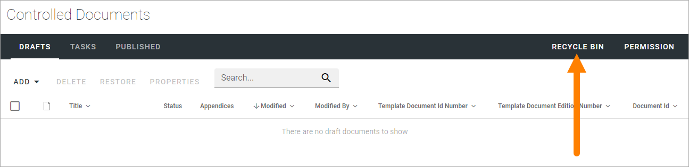

There you can decide to keep a deleted draft for later, permanently delete it or restore it.

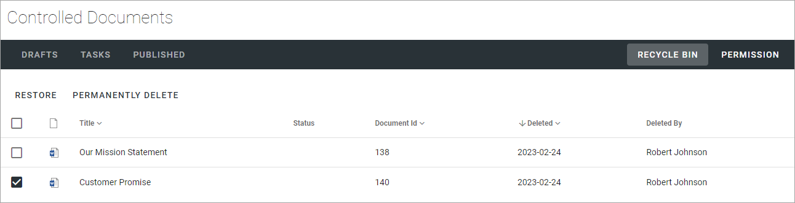

Just select one or more drafts and then decide what do to. (To keep them, no action is required).

Information for administrators: This recycle bin is in fact part of the Sharepoint recycle bin.

Restore a draft document from the recyle bin
-----------------------------------------------
Restoring a draft document from the recycle bin works similar to when a new draft is created from a published document, meaning it's not just a simple restore.

Here's how:

1. Got to the recycle bin and select the document.
2. Click RESTORE.

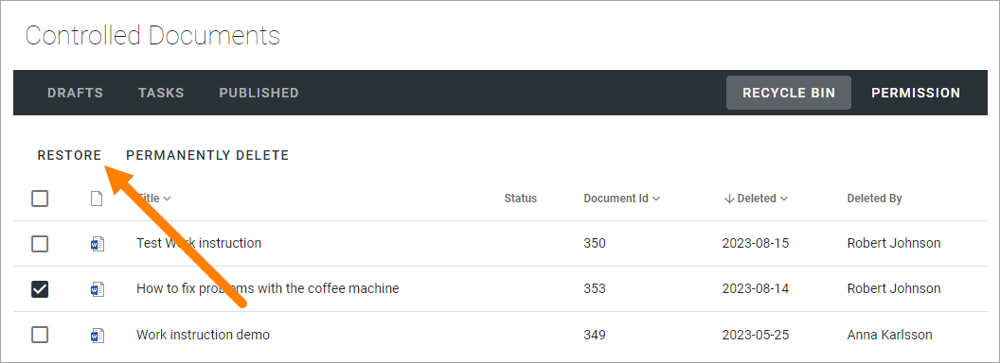

3. Choose what to do:

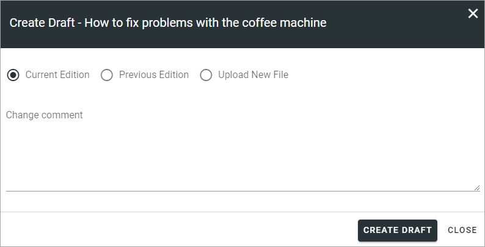

See the heading *Creating a new draft from a published document* below for more informationsa about the options.

4. Click CREATE DRAFT.

Upload Appendices
*******************
To upload documents to use as appendices to another document, the main upload option should not be used. (But you can also use Published Documents as appendices, see below.)

Note that work with appendices (uploading new ones, deleting existing) can only be done when you are working on a draft of the document. If a document is sent for comments or for approval, appendices can not be uploaded to that document. 

Also note that a Document Type contains a setting that states if appendices are allowed or not. For a document tied to a Document Type with appendices not allowed, the Appendices option is not available.

An icon indicates if appendices are attached to a document, and states the number of appendices. (An Appendices column can also be shown). 

In this example the document has 3 appendices:

.. image:: appendix-example-new4.png

Upload or remove appendices this way:

1.	Open the dot menu for the document to add appendices to. 

.. image:: upload-appendice-1-new4.png

2. Select "Appendices".

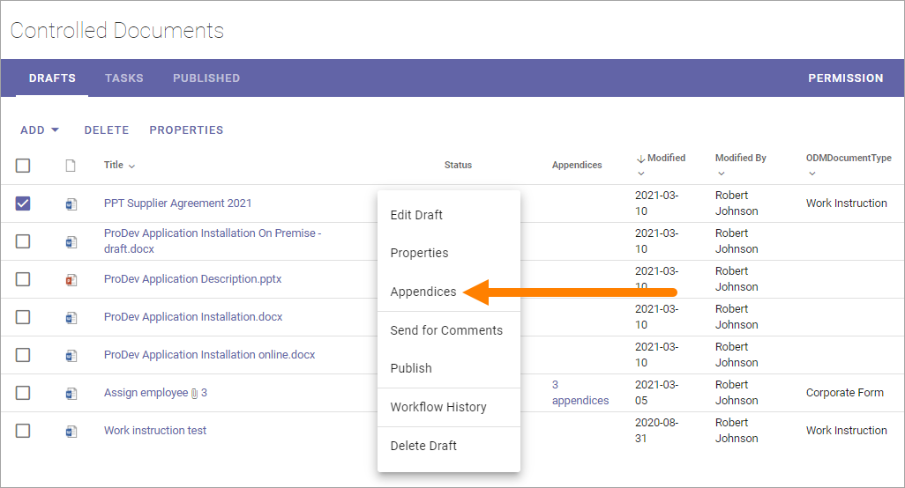

**Note!** You must have added all necessary properties to a document before you can upload appendices. This is indicated by the option "Appendices" being gray and not available.

A list of existing appendices is now shown, if any. You can upload a new appendice or make a copy of a published document to use as an appendice, see below.

Upload a new appendice
------------------------
To upload a new appendice, do the following:
 
1.	Click "Upload".

.. image:: upload-appendice-3-new5.png

2. Use drag and drop or click "Browse" to select one or more documents to upload.

.. image:: upload-appendice-4-new4.png

3. If you happen to select a document that should not be uploaded, just point at the document and click the x to remove it.
4. If you need to edit the file name, just click it and add a new one.
5. Click "UPLOAD".

.. image:: upload-appendice-5-new5.png
 
When the upload is finished the file(s) is visible in the Appendices list for the document, for example:

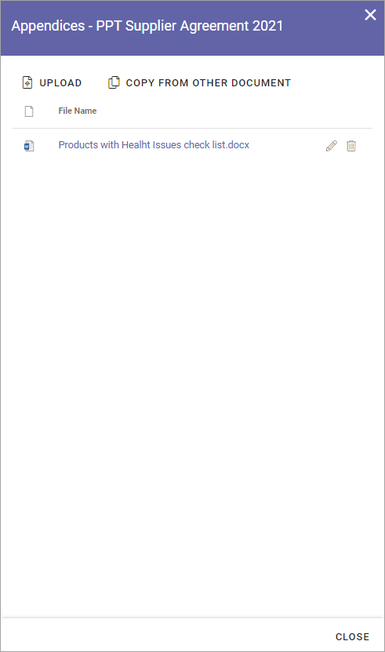

An Appendice document can be opened from here by clicking the link. 

Use the options to the right of the file name to edit or delete the file from the list.

Here's a **tip**: You can open the Appendices window directly from the list. Just click the icon or the link in the Appendices column, if available.

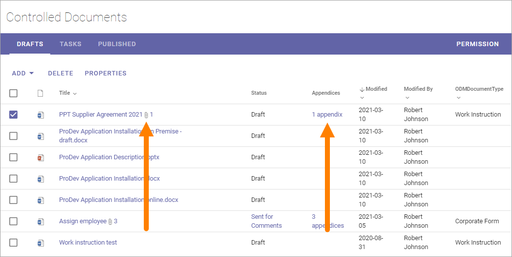
 
Appendices can be added to this list continuously up to publication of the document. If appendices needs to be removed or added for a published document, a new edition of the document must be published.

**Note!** An appendix uploaded as shown above will not be visible as a document in the Drafts list, but will only exist as a part of the main document. When a document with appendices is published, both the main document and the appendices are approved in one go. The appendices does not have to be approved separately (but also see below).

Published documents as Appendices - Copy from other document
---------------------------------------------------------------
Another option is to add a copy of a published document as an Appendice. All published documents are available to select as appendices.

**Note!** In this case it is a copy of a document that will be added. There is no link between the published document and the copy, so if a new edition of the Appendice document is published, the copy used as an appendix is NOT updated. You have to add the published document again to update the appendice.

1. Open the dot menu for the document where you want to add appendices, and select "Appendices".
2. Click "Copy from other Document" in the window shown.

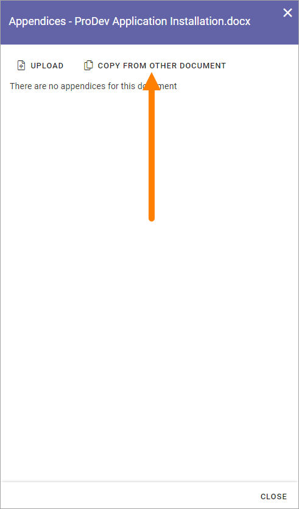

The following is shown:

.. image:: upload-copy-2-new4.png
 
3. Search for the document. 
4. Select the document(s) to add (a copy of) as appendice(s).
5. Choose to overwrite existing appendices or not. This option is useful if a new version of a document you use as a appendice has been published and you want to replace the old copy with the new edition.
6. Click "Copy".

.. image:: upload-copy-3-new4.png
 
The documents added to the Appendices list this way is handled exactly the same way as a document uploaded as an appendix, see above. (And remember that it is a copy of the original document.)

Creating a new draft from a published document
***********************************************
The work on a draft for a new edition of a document can be started whenever it’s convenient. The existing published edition is still available for readers until it’s replaced, when the new edition is published.

To create a new draft of a published document, do the following (images from Omnia v7):

1.	Open the "Published" tab.
2.	Click the dot menu for the document.
3.	Select "Create Draft".

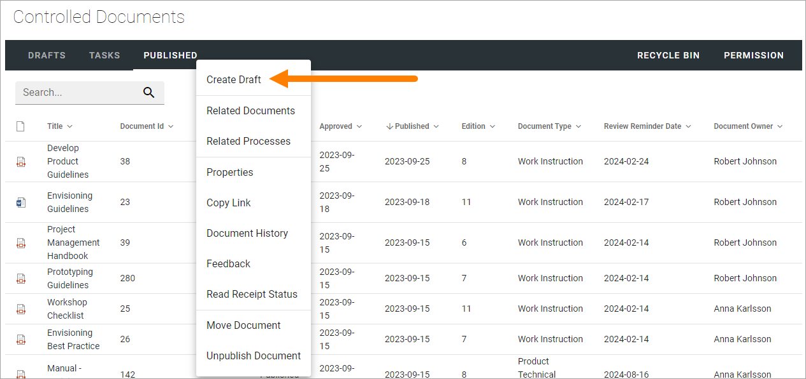

4. If the document is not tied to a template, it can now be done. In that case something like the following is shown:

.. image:: create-draft-1-new-new.png

If you select "Yes", open the list and select a template.

.. image:: select-template-select-new2.png

The author will also be notified if the template the document is based on, is updated, see below.

If the document already is tied to a template that is not updated, this is shown:

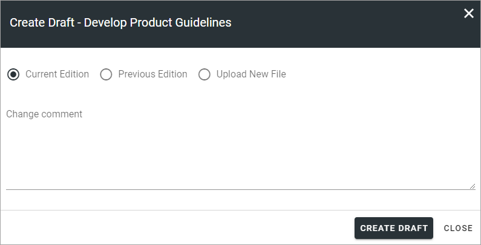

4. Select which edition to base the new draft on.

As you see you can even upload a document to base the new draft on. This can be useful for example when you want to publish a new edition of a document you have uploaded as it is. Perhaps you have received a new version of a document from a supplier?

The first time a new draft is published the "Change comment" field is available, for all editions from here on. You can use it do add a comment now, or later. For more information, see below.

If you select "Previous Edition", you can open the list and select which of the previous published editions you want to base the new Draft on. If you want to have a look at that edition before deciding, you can download a copy of the previous edition you selected in the list, by first selecting the edition and then clicking this icon:

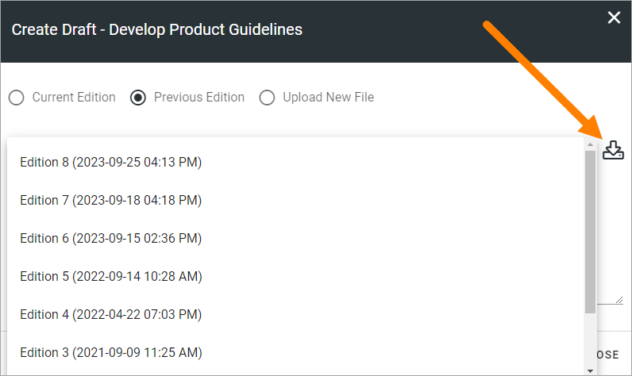

5. When you're done there, click "Create Draft".

The new draft is created and the "Drafts" tab is automatically activated. The work on the new draft is done exactly as the first time. That a document has been published before does not make any difference.

**Note!** There can be only one draft of a given document. If there already is a draft for the document and an author tries to create another one, a message is shown stating that it's not possible. 

Change comments
--------------------
When creating a new draft from a published document the first time, the Change comments field is available from here on (in Omnia 7.1 and later). **Note**: the field is NOT available when a draft is created from scratch or uploaded to be a draft.

You can add and edit change comments when necessary for any edition, either when creating a new draft from any edition or any time when working on a draft that has been created that way.

When working on a draft, the Change comments field is available here:

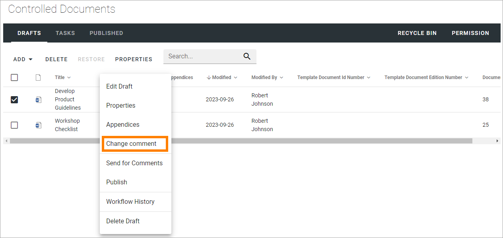

Here's an example:

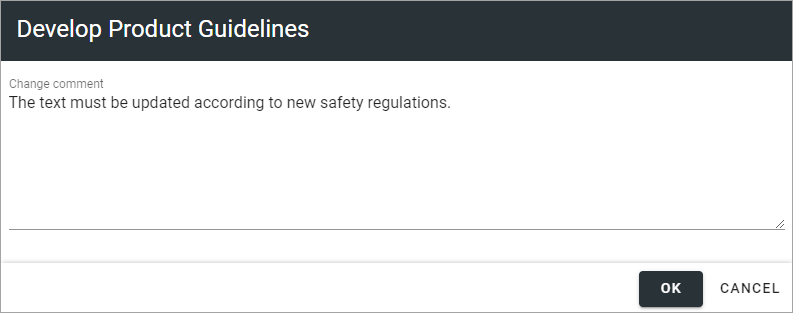

Just add and edit text here as needed, and click OK to save.

Change comments are added to the document history and can therefore be accessed on the PUBLISHED tab together with alla other document history. Here's an example from a test environment:

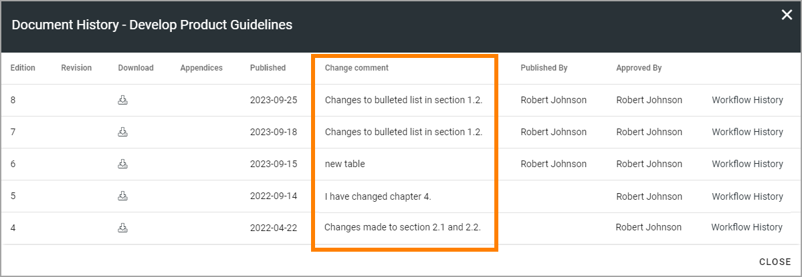

Show changes
******************
If the feature "Document Comparison powered by Draftable" is activated for the tenant, the options for viewing changes in a document are extended and improved. Microsoft Office documents, as well as PDF:s, can be used. The files does not have to be open. **Note!** This option requires a paid subscription with Draftable. 

When the feature is activated the menu option "Show changes" is available. A draft can then be compared with the latest published edition of that document, using this menu option:

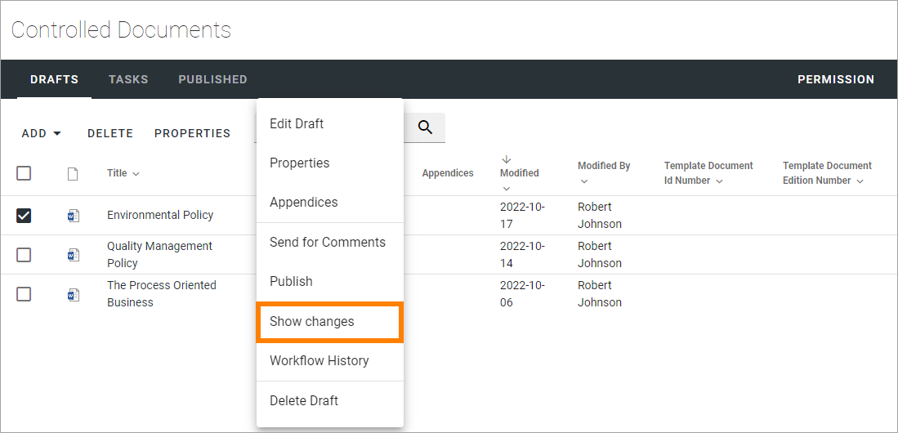

Here's an example for Microsoft Word documents:

.. image:: show-changes-example.png

This option can be used by reviewers when a document is sent for comments:

.. image:: show-changes-comment-new.png

An approver for publication can also use this option:

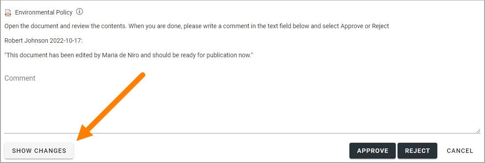

If the feature is activated, this option is also available for all users in a doucment rollup, through the i icon:

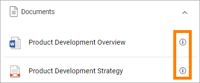

Here's an example:

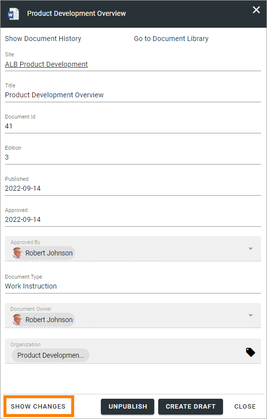

Remember that there must be at least two editions of a document for this option to show up, and that it requires a paid subscription with Draftable.
 
New drafts and templates
***************************
If there is a new version of the template used for the document, the author will be notified and can choose to use the new version of the template, or stick to the old one, for example:

.. image:: document-template-new-edition.png

A special case is when a new draft is created from a Word or Excel document that was uploaded rather than created from scratch. When a new draft for a second edition is created, the template can be altered (or rather selected). But using a template for an uploaded document is never mandatory, the document can always be used as is.

When selecting a template for an uploaded document, it’s always a good idea to use the preview to make sure the selected template actually works for the document.

If a template is selected, this document is from now on related to the template the same way as when a new document is created from scratch on the "Drafts" tab.

Even if a template is not selected for the second edition, the author gets a new chance the next time a new draft is created.

More on what happens when a document is merged with a template
-----------------------------------------------------------------
Here's some more information about what will happen if you choose to merge a document with a template.

Omnia will attempt to keep the following when a document is merged with a template:

+ Fonts and Formats.
+ Page Size and Orientation.
+ Margins.
+ Contents and references.

But as a document format can be quite complex changes can still occur, even regarding fonts and sizes. All merged templates must be checked.

Header and footer may change, especially where text and numbering are placed. Also make sure that the correct language is selected for all parts of your document, to avoid any unnecessary changes regarding header and/or footer in your document.

