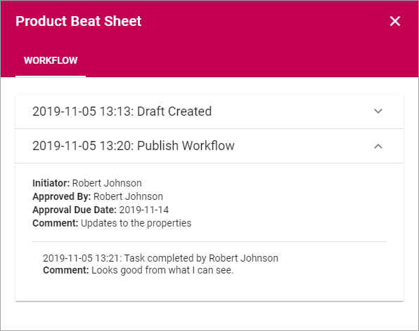
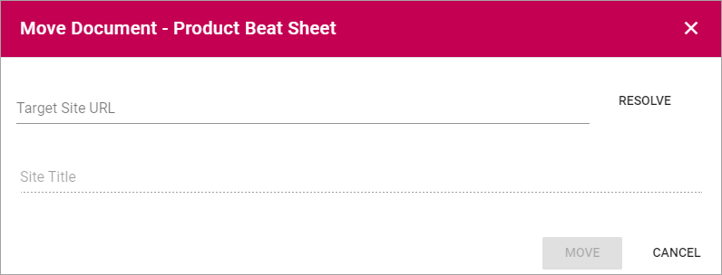
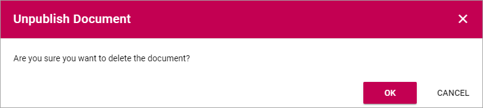

Working with Published documents
=================================

The Published tab lists the latest edition of all published documents from this Controlled Documents library. There are some useful options for a published document, you can for example check the Properties, see the Document History, see Feedback that users has sent and Move a document.

A site Administrator (Owner) can set up which columns to show on this tab. Here's an example:

.. image:: published-example.png

Checking a documents properties
*********************************
The properties for a published document can be checked this way:

1.	Click the dot menu for the document.
2.	Select "Properties".
 
The Properties window for the document is shown, for example:

.. image:: published-properties.png
 
The properties can not be edited here. The properties can only be edited when working on a draft for a new edition of the document.

Document History
******************
There’s information about each published edition available. To see it, do the following:

1.	Click the dot menu for the document.
2.	Select "Document History".
 
Here’s an example:

.. image:: published-history.png
 
You can see the publication date for each edition, the author’s comment, if any, and who the document was approved by. The option "Workflow History" for an edition will show information about when workflows was used and the comments entered during the workflows, so here you can even see information from Send for Comments workflows used for the document.

Here's an example:

Check Feedback
****************
Any user can send feedback on a published document and that feedback is available for authors here. The read feedback for a document:

1.	Click the dot menu for the document.
2.	Select "Feedback".
 
The feedback posts for the document is shown. Here's an example:

(Image to be added soon).

You can click the dust bin to delete the feedback when you have read it, or keep it for later reference, it’s up to you.

Move a document
*****************
A published document can be moved to any other site with a Controlled Documents library. If a draft for a new edition of the document is present, the draft must first be deleted.

**Note!** You must first check and note (or copy) the URL to the site you want to move the document to.

1.	Click the dot menu for the document.
2.	Select "Move Document".
 
The following is shown:

 
3.	Type the URL (or paste, if you have copied it) to the site in the top field and click "Resolve". 

If the URL is correct the site title is shown in the second field.

4.	Click "Move".

Create Draft
**************
You can create a new Draft from a published document and start working on the new edition when you need it. The existing edition is still available for users until it's replaced, when the new edition is published.

For more information on how to create a new draft, see the heading "Creating a new draft from a published document" on this page: :doc:`Working with Drafts </working-with-documents/authoring-controlled-documents/working-with-drafts/index>`

Related Documents
*******************
You can related a published document to other published documents. How to do that is described on this page: :doc:`Related Documents </working-with-documents/authoring-controlled-documents/related-documents/index>`.

Read Receipt Status
********************
This option has to do with the option "Notify people" an author can select when publishing a document. See this page for more information: :doc:`Read and Understood - Notify and Read Receipt </working-with-documents/authoring-controlled-documents/read-and-understood/index>`.

Unpublish
**********
If needed, a published document can be unpublished. The document will then not be available for reading. The document is also removed from the Controlled Documents library and a copy is placed in the archive.

**Note!**
A document can't be unpublished if a draft has been created for that document. The draft must first be deleted.

The "Unpublish" option can be used on the "Published" tab and is found in a document's menu, for example:

.. image:: unpublish.png

When "Unpublish" is selected, you get a second chance to change your mind:

