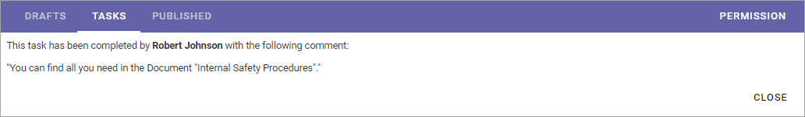

Working with tasks
===================

Using the Tasks tab you can see three different lists:

Assigned to me
***************
As it says, this list displays all tasks that have been assigned to you. 

.. image:: controlled-tasks-me-new2.png

It can be:

+ Tasks from send for comments workflows - labeled "Review document" in this list.
+ Tasks from publish workflows - labeled "Approve document" in this list.
+ Tasks for review when set review date has passed - labeled "Review" in this list.

To work with a task, just click the title, and then something like the following is shown:

.. image:: controlled-tasks-me-2-new2.png

You can click the link to read the document. To see additional information about the document, click the i icon. Here's an example of document information:

.. image:: controlled-tasks-me-3-new2.png

To go back to the list, click "Cancel".

Assigned by me
****************
This list displays all Tasks created, when you sent a document for comments or when publishing a document. Note that if you assigned a send for comments task to more than one colleague, one task for each colleague is created, as in this example:

.. image:: controlled-tasks-byme-1-new2.png

To check the progress for any of the tasks, click the Title. Something like the following is then shown:

.. image:: controlled-tasks-byme-2-new2.png

In the example Anna has not started here review yet. When she has it will be noted after the "Status" heading and the comment(s) she added will be seen here.

Completed tasks
****************
As it says, this tab displays a list of completed tasks, for example:

.. image:: controlled-tasks-completed-new2.png

You can see additional information, for example comments, by clicking the title. Here's a simple example of what can be shown:

