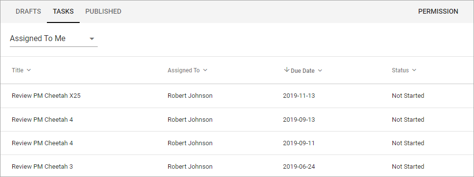

Working with Tasks
===================

Using the Tasks tab you can see three different lists:

Assigned To Me
***************
As it says, this list displays all tasks that have been assigned to you. 

It can be:

+ Tasks from Send for Comments workflows - labeled "Review document" in this list.
+ Tasks from Publish workflows - labeled "Approve document" in this list.
+ Tasks for review when set Review Date has passed - labeled "Review" in this list.

To work with a task, just click the Title, and then something like the following is shown:

.. image:: controlled-tasks-me-2.png

You can click the link to read the document. To see additional information about the document, click the i icon. Here's an example of document information:

.. image:: controlled-tasks-me-3.png

If it's a task for reviewing a document when the Review Date has passed (as in the example above), you check the document and can decide what to do; set a new Review Date, unpublish the document or create a new draft of the document.

To go back to the list, click "Cancel".

Assigned By Me
---------------
This list displays all Tasks created, when you sent a document for comments or when publishing a document.

.. image:: controlled-tasks-byme-1.png

To check the progress for any of the tasks, click the Title. Something like the following is then shown:

.. image:: controlled-tasks-byme-2.png

