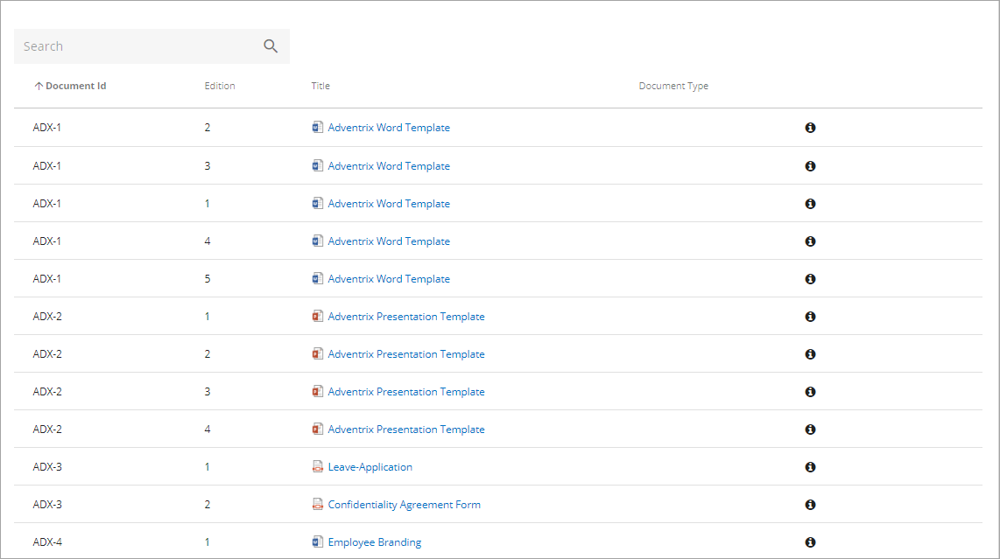
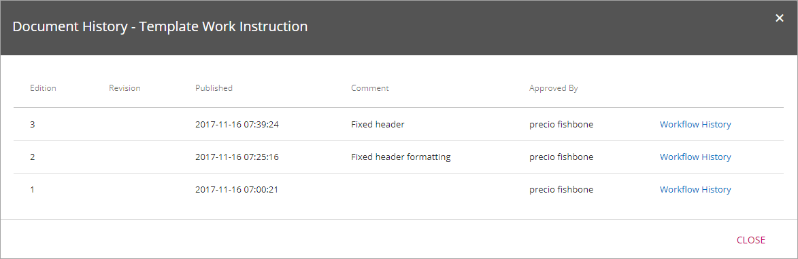

Controlled documents archive
================================

There is always at least one archive for a Document management installation, regardless of the number of teamsites used for authoring and publishing - but there can be several archives. The Controlled Documents Archive(s) are set up during installation. There is no settings you can do there.

The addresses to the Archive(s) are shown in Document Managment Settings in Omnia Admin.

.. image:: dm-archive-address-new2.png

To be able to access the Archive, you must have permission to do so. This permission is completely separate from any set in the Team site. The Archive exists in a different Page Collection. 

A copy of all published document's editions are normally placed in an archive, but for some document types that really don't need to be archived, it can be turned off. In which archive douments of a certain document type should be archived (if there are several archives) can also be set for the document type. See the heading "Archive" on this page: :doc:`Document types </admin-settings/tenant-settings/document-management/document-types/index>`

The following information is available in the archive:

 
You can search for documents and sort the list on the headings, to make it easier to find information about a certain document edition.

To have a look at the contents of a specific edition of a document, click the document title.

You can see information about an edition by clicking the i-icon.

.. image:: archive-icon-new2.png

Here's an example:

.. image:: archive-icon-info.png

To see document history, click the link.

.. image:: archive-icon-info-click-history.png
 
Document history for all published editions is now shown, for example:

Note the column "Published" where you can see date and time when each edition was published and then replaced the earlier edition.

Workflow history for each edition of the document, for both send for comments workflows and for publication workflows, is also available here. Click the link for an edition to see it.

.. image:: archive-icon-info-history-click-workflow.png

Expand a workflow to see more details, for example:

.. image:: archive-icon-info-history-workflow.png

Note that you can even see comments added by reviewers and approvers, in the example above from the approver. This way you can track the process for an edition of a document; when a draft was crafted, what reviewers commented, when the edition was published and what the approver commented.
