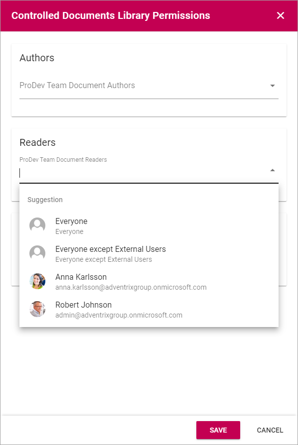

Controlled Docments Library Settings
=======================================

You must be Administrator (The permission group is most often called "Owners") of the Team Site - there can one or more - to be able to edit the settings for the three lists in the Controlled Documents library, and to edit permissions.

Settings for the tabs
***********************

To access the seetings, go to the Controlled Documents library and click "Edit".

.. image:: edit-controlled-library.png

General
-----------
Here you can use the following settings:

.. image:: edit-controlled-library-general.png

+ **Title**: You can edit or add a Title for the list in all languages available for the tenant. The default language is mandatory. 
+ **Open In Client App**: Per default, documents are opened in the online Office 365 application. If documents should be opened in the locally installed application instead, select this option. 

Display
----------
Here you can set the following:

.. image:: edit-controlled-library-display.png

+ **Default tab**: Decide which tab will be shown when an author enters the Controlled Documents library.
+ **Paging**: Select paging for the lists here; “No paging”, “Classic” or “Scroll”.
+ **Page Size**: Set the number of rows to display. **Important Note**: If more documents or tasks are available than the Page Size set, a navigation to the next page is shown when Paging is set to "Classic". If Paging is set to either "No paging" or "Scroll", Page Size is the maximum number of documents or tasks that can be shown in the lists, regardless of how many are available.
+ **Padding**: Set some padding around the lists, if needed.
+ **Hide Tasks Tab**: If the Tasks tab should not be displayed for authors, select this option.

Drafts
--------
The following settings are available here:

.. image:: edit-controlled-library-drafts.png

+ **Default Ordering Field**: Select the column for default sort order for the list.
+ **Show Search Box**: If authors should be able to search for documents here, select this option.
+ **Display columns in draft view**: To add a new column, select it in the list and click "Add". To remove a column. click the dust bin. If no dust bin is shown for a column it's mandatory, and therefore can't be removed. You can set the order of the columns by grabbing the Equal To icon for the column and drag it to another place in the list.

Published
------------
The same type of settings as for Drafts are available here:

.. image:: edit-controlled-library-published.png

See above for a description.

Default Document Types
------------------------
(Will be added soon.)

Permissions
************
If Document Management is set up for using permission groups, you can, as an Administrator (Owner) of the Team Site, edit these permissions.

Do the following:

1. Click "Permissions" in the Controlled Documents library.

.. image:: click-permissions.png

Something like the following is shown:

.. image:: controlled-permissions.png

You can add/remove groups and/or users to these lists.

2. To edit permissions, open the list.

You can also add groups or users by typing the name in the field.

If permission groups are used, as in the example above, you can add and remove users in these groups by using the Sharepoint standard functionality "Advanced permissions settings".

.. image:: advanced-permissions-settings.png

