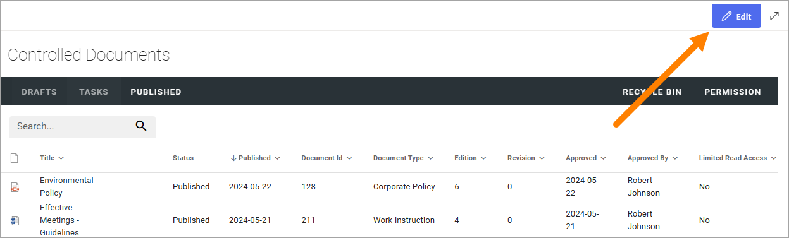
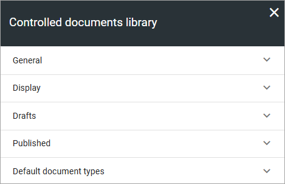
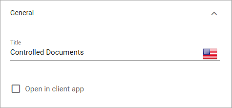
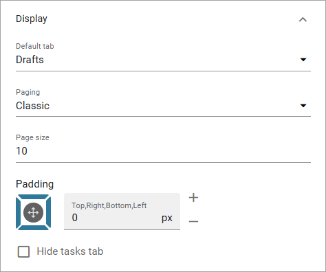
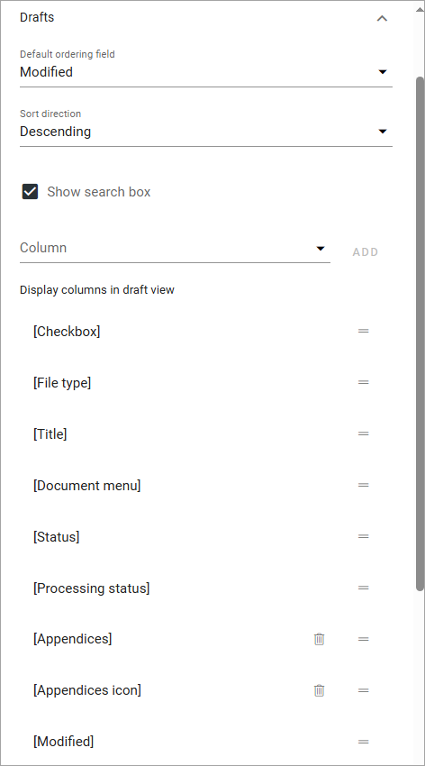
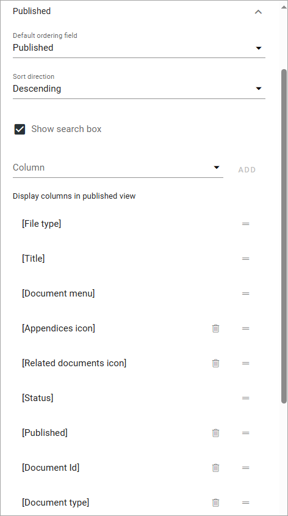

Controlled documents library settings
=======================================

You must be administrator (the permission group is often called "Owners") of the teamsite - there can be one or more - to be able to edit the settings for the three lists in the controlled documents library, and to edit permissions.

Settings for the tabs
***********************
To access the seetings, go to the controlled documents library and click "Edit".

Here, the following settings are available:

General
-----------
Here you can use the following settings:

+ **Title**: You can edit or add a title for the list here. 
+ **Open in client app**: Per default, documents are opened in the online Microsoft 365 application. If documents should be opened in the locally installed application instead, select this option. 

Display
----------
Here you can set the following:

+ **Default tab**: Decide which tab will be shown when an author enters the controlled documents library.
+ **Paging**: Select paging for the lists here; “No paging”, “Classic” or “Scroll”.
+ **Page size**: Set the number of rows to display. **Important note**: If more documents or tasks are available than the page size set, a navigation to the next page is shown when paging is set to "Classic". If paging is set to either "No paging" or "Scroll", page size is the maximum number of documents or tasks that can be shown in the lists, regardless of how many are available.
+ **Padding**: Set some padding around the lists, if needed.
+ **Hide Tasks tab**: If the Tasks tab should not be displayed for authors, select this option.

Drafts
--------
The following settings are available for the Drafts tab:

+ **Default ordering field**: Select the column for default sort order for the list.
+ **Sort direction**: Select Descending or Ascending here.
+ **Show search box**: If authors should be able to search for documents in the list, select this option.
+ **Column**: Use this option to add a column to be shown. Open the list, select the column and click "ADD".
+ **Display columns in draft view**: Here the selected columns are listed. To remove a column, click the dust bin. If no dust bin is shown for a column it's mandatory, and therefore can't be removed. You can set the order of the columns by grabbing the equal-to-icon for the column and drag it to another place in the list.

Published
------------
The same type of settings as for drafts are available here. See above for a description.

Default document types
------------------------
Use this setting to select one or more document types to be suggested when an author creates a new draft document in this controlled documents library.

As an example, these settings:

.. image:: default-types-example-2.png

Will result in the following:

.. image:: default-types-example-2-wizard.png

A user can always click "Show all" to see all available document types. More information about how the document wizard works is found here: :doc:`Using the create new document wizard </working-with-documents/using-the-document-wizard/index>`

To add a document type, do the following:

1. Click in the field.

.. image:: document-type-add-1-new.png

2. Use the list to select one or more Document Types. 

.. image:: document-type-add-2-new.png

If the document types are grouped (as in the image above) you may need to expand a group to select a document type there. 

Also note that you can deselect document types as well using this list.

For more information about document types, see this page: :doc:`Document types </admin-settings/tenant-settings/document-management/document-types/index>`

Permissions
************
If Document management is set up for using permission groups, you can, as an administrator (Owner) of the teamsite, edit these permissions.

**Important note for Omnia 7.0 and later!** Only SharePoint users can be added here (not Omnia only users). Also note that a user or a group must be permissions enabled to show up in the list.

Do the following:

1. Click "Permissions" in the controlled documents library.

.. image:: click-permissions-new2.png

Something like the following is shown:

.. image:: controlled-permissions-new2.png

You can add/remove groups and/or users in these lists.

If permission groups are used, as in the example above, you can add and remove users in these groups by using the SharePoint standard functionality "Advanced permissions settings" - found under "Site permissions" in the settings for the site. 

.. image:: advanced-permissions-settings-new2.png

Note that external users that has been invited in Entra ID can be added here as well. Users invited this way can log in with their own Microsoft 365 account.

Settings for Document management is found under that heading in Omnia admin, see this part of the documentation for more information: :doc:`Document management </admin-settings/tenant-settings/document-management/index>`

