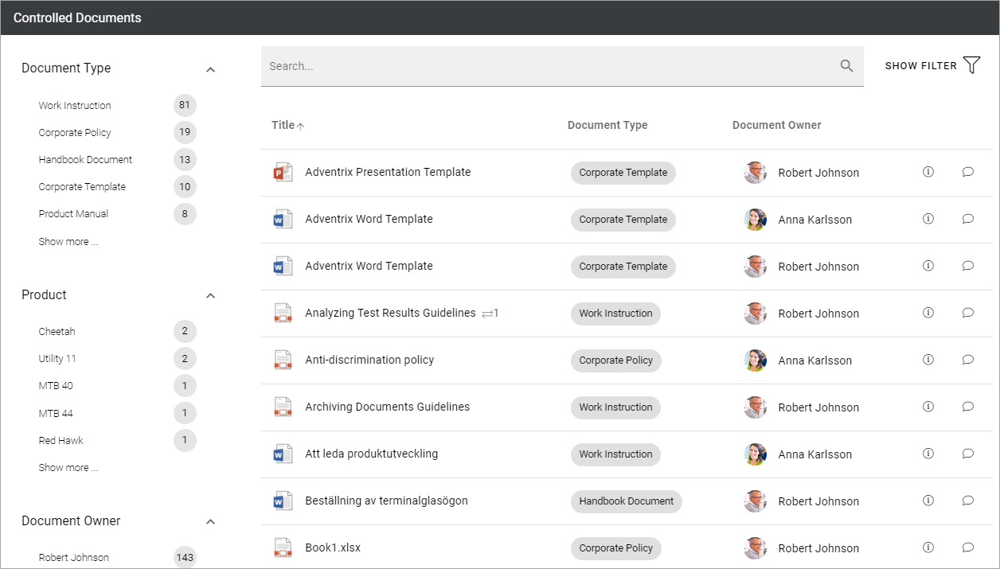
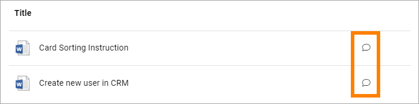
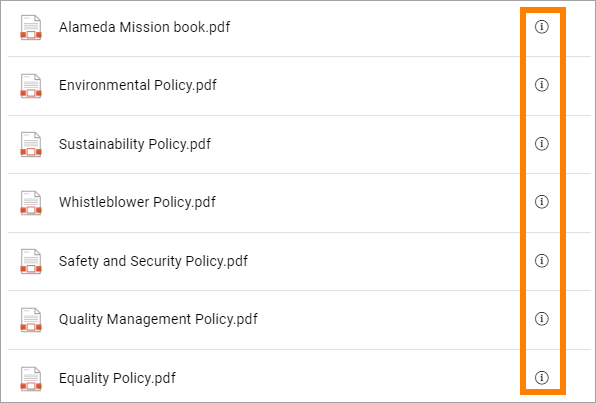
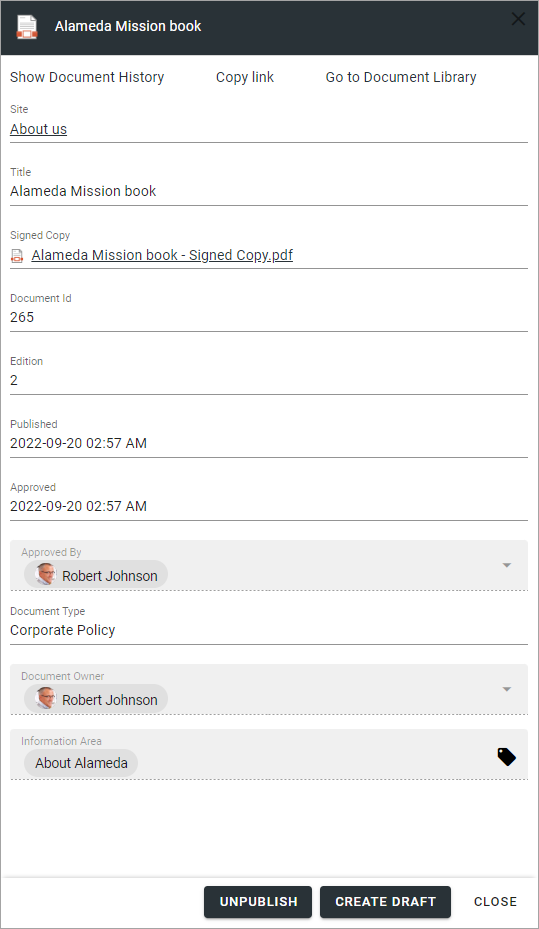

Reading controlled documents
=============================

To make controlled documents available for users you add a Document Rrllup block to a suitable page. Heres's an example of how a controlled documents list can look for users:

See this page for more information on how to use the Document rollup block for this purpose: :doc:`Document rollup </blocks/document-rollup/index>`

Under the heading "Implementation example" you can see the settings that has been made for a Controlled documents rollup.

Sending feedback
******************
If the document rollup has been set up to allow it, it can be possible for users to send feedback on controlled documents.

If it's possible, this icon is available:

By clicking the icon, the following can be used to send the feedback:

.. image:: document-feedback-form.png

Note the formatting options. Also note that the receiver of the feedback Email is noted.

Feedback can be accessed by all authors of a controlled documents library, using the Published tab.

More information about a document
************************************
If available, you can click the i-icon for more information about a document.

Here's an example of information that can be available:

Note the options at the top, where you can go to document history for this document, copy the link to the document and go to the document library where the document is stored (if you permissions to do that).

The buttons at the bottom (UNPUBLISH AND CREATE DRAFT) are only available for authors of documents. If you don't have the appropriate permissions, they are not shown.
