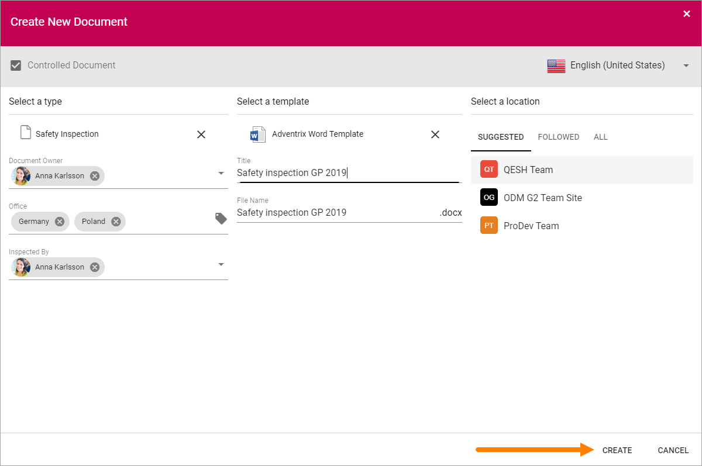
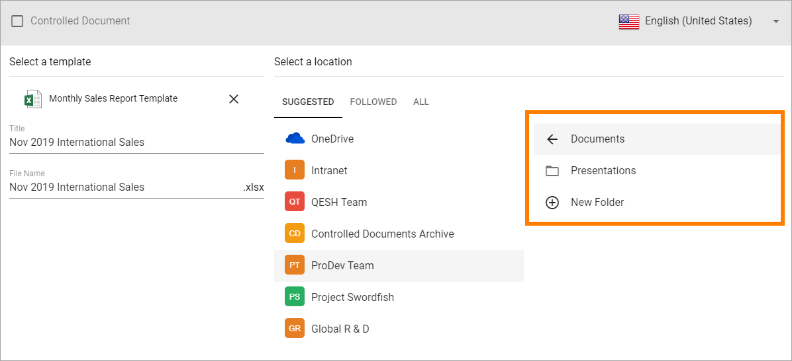
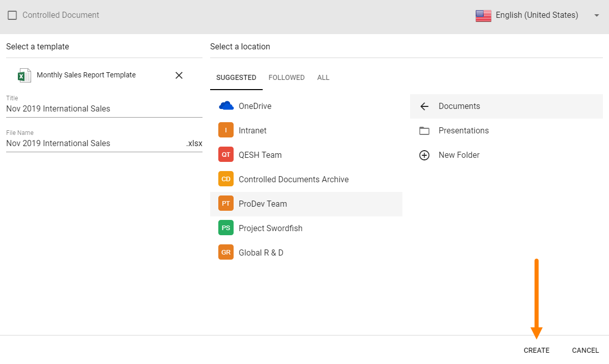

Using the Document Wizard
===========================

When you create a new Controlled Document or a normal document where the Document Wizard is activated, you normally see a list of the templates available. It can look like this:

.. image:: document-wizard.png

Creating a new Controlled Document
************************************
Use the Wizard this way to create a new Controlled Document:

1. See to that "Controlled Document" is selected.

.. image:: new-controlled-1.png

2. Select language.

.. image:: new-controlled-2.png

When a template is created, the language for the template is set. 

3. Select the Document Type the template belongs to. You may have to open a group to find the Document Type you're after, as this example shows:

.. image:: new-controlled-3.png

The Document Types are set up in Omnia Admin.

4. Select Template.
5. Some settings are most likely needed. Which settings depends on the Document Type. Heres an example:

.. image:: new-controlled-4.png

6. Select template (in this exemple only one template is available for the Document Type, but there can be several). You must click on the template, even if there's only one, for the fields to be shown.
7. Add a title for the new document.
8. Edit the file name if needed.

.. image:: new-controlled-5.png

7. Select where to save the new document. The active site is selected in the "suggested" list.

.. image:: new-controlled-6.png

If you want to save the file somewhere else, use the lists "Suggested", "Followed" and "All" to navigate to teh site. Note that all three lists may not be shown depending on settings in Omnia Admin.

8. Click "Create".

The document is now created in the chosen location and you can work on it the normal way. 

.. image:: new-controlled-8.png

**Note!** If you come across metadata fields visible in the document, displayed within double brackets, they should not be used in the editing process. Information will be added to these fields when the document is published.

Creating a Normal Document
****************************
An author of controlled documents can always create normal documents as well in the Controlled Documents library he or she has access to, if templates for normal documents are set up in Omnia Admin. To make it possible for other users to create normal documents using the Document Wizard, som kind of access to the wizard has to be set up. For example, an icon can be visible in the Action Menu:

.. image:: document-wizard-start.png

This is done using the Admin Settings for the Business Profile. See this page for more information: :doc:`Settings for the Business Profile </admin-settings/business-profile-settings/settings/index>`

To create a new normal document, do the following:

1. Start the Document Wizard where it is available.
2. Make sure Controlled Document is NOT selected (if a user don't have permission to create Controlled Documents, the option can't be selected).

.. image:: normal-document-1.png

3. Select language for the template.

.. image:: normal-document-2.png

4. Open a Template Group if necessary and then select template.

.. image:: normal-document-3.png

5. Add a Title, edit the File Name and add other information that may be needed for the template, depending on how it is set up.

.. image:: normal-document-4.png

6. Select a location to save the document to.

.. image:: normal-document-5.png

OneDrive is your personal Office 365 OneDrive. If "Intranet" is selected - if available - a list of folders you have      access to in the intranet is shown. The rest of the locations are normally available Team Sites.

7. Select folder in that location.

**Note!** if it's a Team Site where you are a member, you can even create a new folder if needed.

8. Click "Create".

