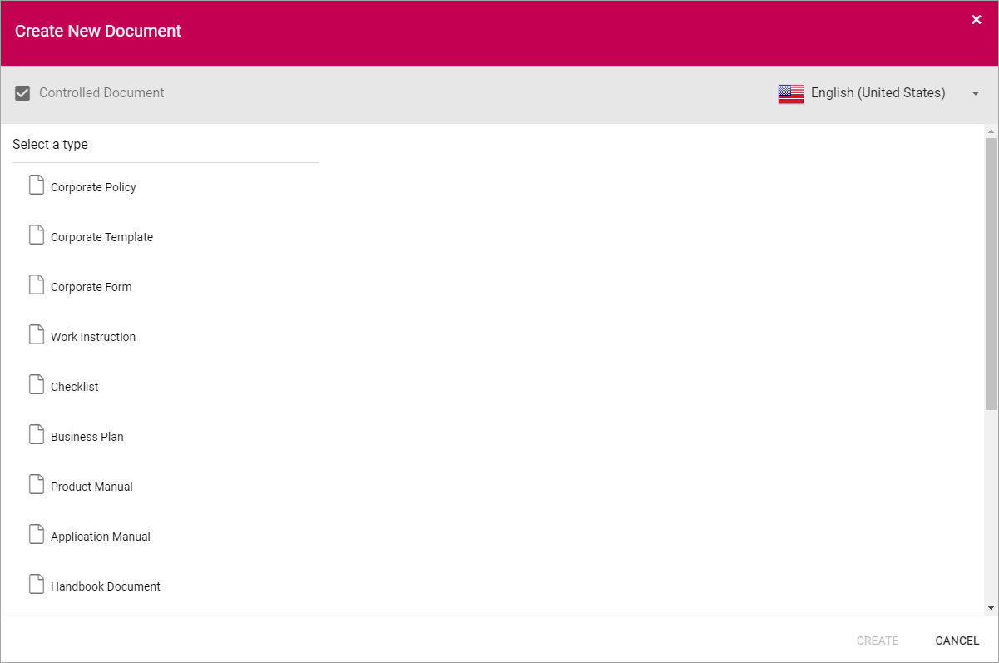

Using the Document Wizard
===========================

When you create a new Controlled Document or a normal document where the Document Wizard is activated, you normally see a list of the templates available. It can look like this:

Creating a new Controlled Document
************************************
Use the Wizard this way to create a new Controlled Document:

1. See to that "Controlled Document" is selected.

.. image:: new-controlled-1.png

The Document Types are set up in Omnia Admin.

One or more Document Templates are available for a Document Type. If more than one is available, the next step is to select template.

.. image:: new-draft-2-new.png

And enter a Title and a File Name.

.. image:: new-draft-2b-new.png

And then, the next step is to enter information for the document’s properties (metadata). What that will look like depends on the Document Type. Here’s an example:

.. image:: new-draft-3-new.png

A number of mandatory fields can be present, marked with an asterisk (*). All mandatory fields must be filled in, or the document can  not be published, but it does not have be now.

Metadata can also, in some cases, be used as a filter for document lists, to make Controlled Documents available for users when they are published. Besides that, available approvers can depend on the metadata added. It’s always very important that information in metadata fields are added thoroughly.

A "tag" icon to the right in a field always indicates that it is a managed metadata field, for example:

.. image:: new-draft-4-new.png

When the properties has been entered and the author clicks "Create", the editing program (for example Microsoft Word for Word files) starts with the chosen document layout. Text and so on is entered the normal way. 

**Note!** Metadata fields visible in the document, displayed within double brackets, should not be used in the editing process. Information will be added to these fields when the document is published.