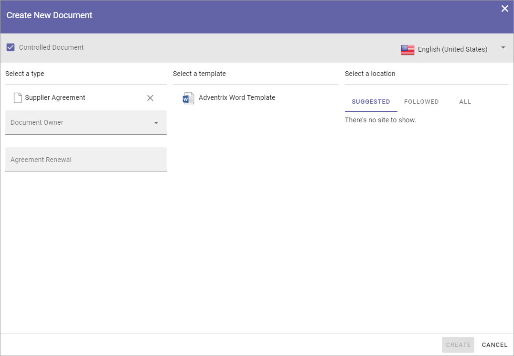
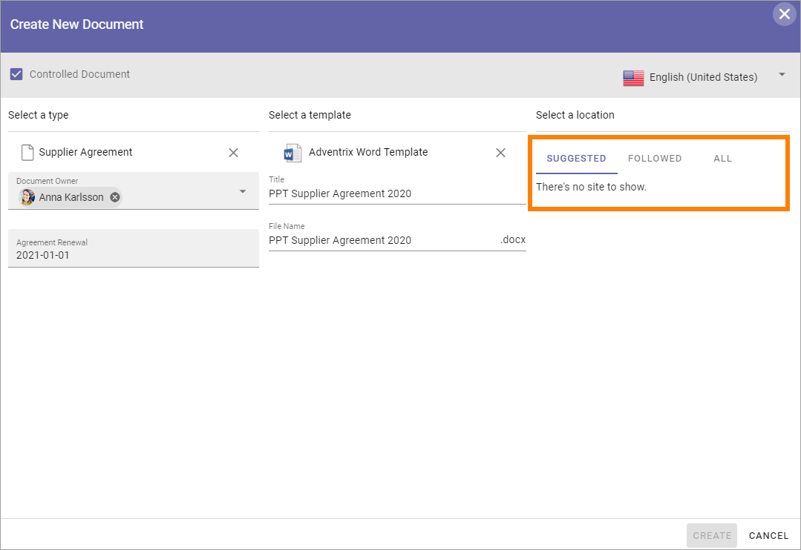
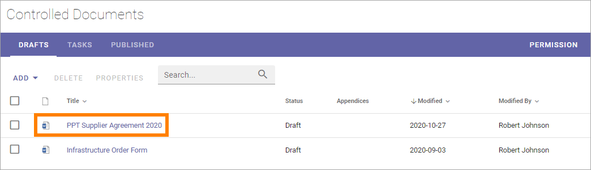
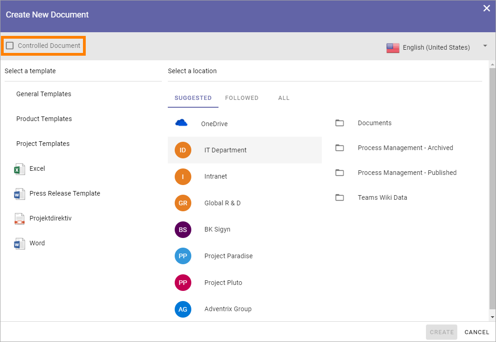
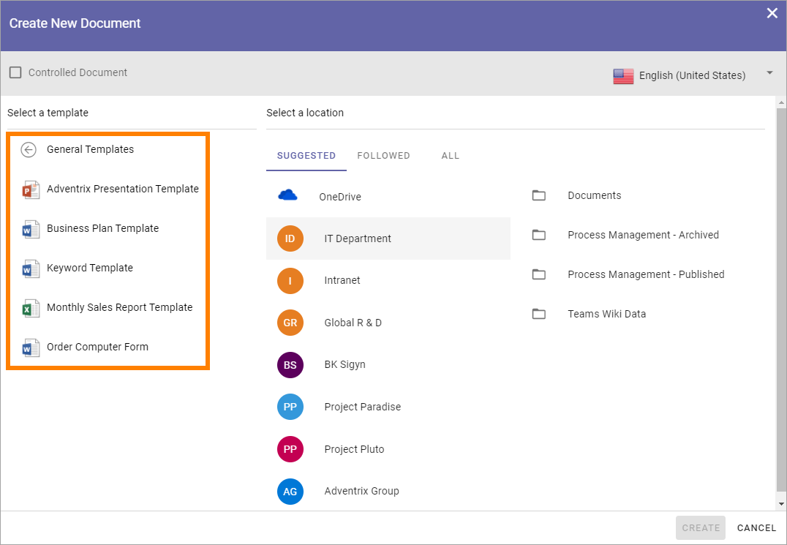
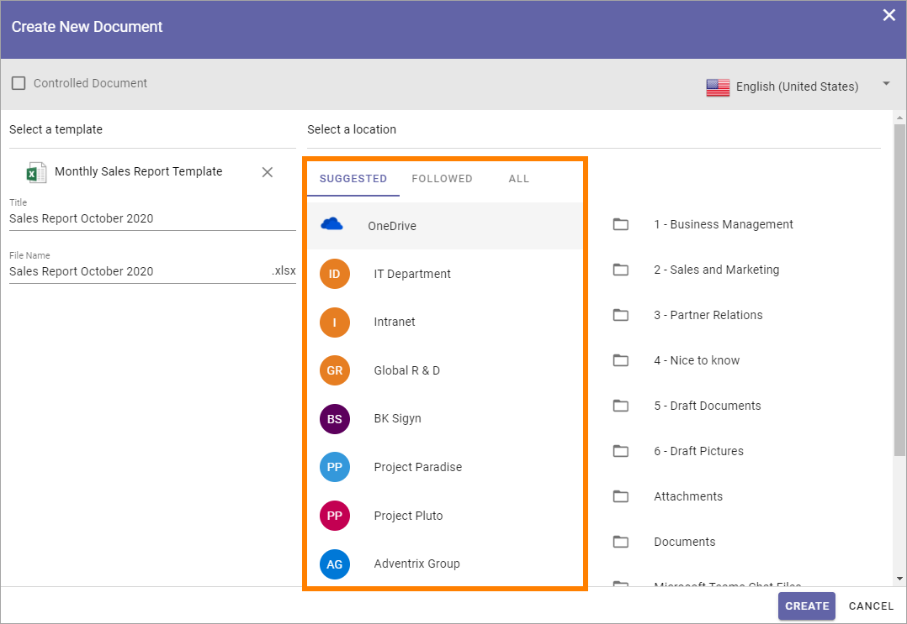
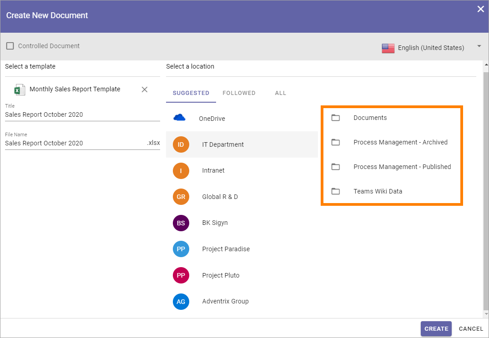
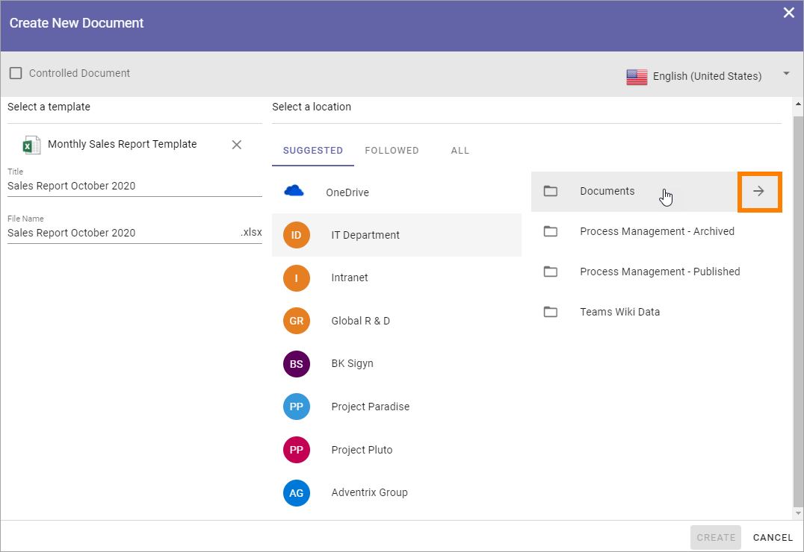
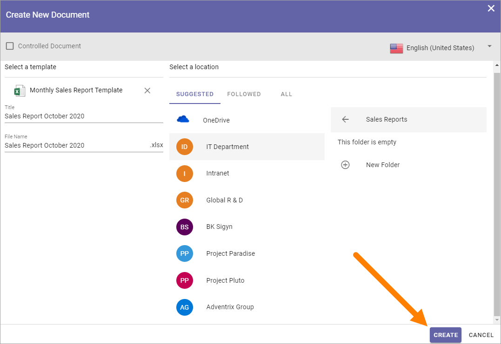

Using the Create the New Document Wizard
============================================

The Create New Document Wizard can be used to create either Controlled Documents or normal documents. A new document created in the wizard can be saved in any libray the loged in user has access to (a Controlled Documents library for a Controlled Document or a Documents library for a normal document). 

This wizard is always available in all Controlled Documents libraries.

To be available in other document libraries, the Create New Document Wizard must be activated in the Features for each Teamwork App. 

The wizard can also be available in the Action Menu:

.. image:: action-menu-document-wizard.png

The setting for making the wizard available in the action menu is found in the Header settings for the Business Profile. See the heading "Action Menu" on this page for more information about the setting: :doc:`Header settings for the Business Profile </admin-settings/business-group-settings/settings/header/index>`

Creating a new Controlled Document
************************************
Use the Wizard this way to create a new Controlled Document:

1. See to that "Controlled Document" is selected.

.. image:: new-controlled-1-new2.png

2. Select language if needed.

.. image:: document-wizard-language-new2.png

There can be different sets of document types depending on language chosen. If your organization is producing controlled documents in several languages, you may have to select language to see the correct set of document types.

3. Select the Document Type the template belongs to.

The Document Types are set up in Omnia Admin. The first list you will see here is normally the most commonly used document types. A Document Type contains a number of templates. You may have to open a group to find the Document Type you're after.

4. Some settings are most likely needed, depending on the Document Type. Here's an example:

5. Select template document. You must click on the template, even if there's only one.
6. Add a title for the new document.
7. Edit the file name if needed.

.. image:: new-controlled-5-new2.png

8. Select where to save the new document. 

If you are creating a new document in a Controlled Documents library, the active site is selected in the "suggested" list. If you have started the wizard from the Action Menu, no location can be suggested, as is shown in the above image.

To select where to save the document, use the lists "Suggested", "Followed" and "All" to navigate to the site. Use "All" to search for a library,

9. Click "Create".

.. image:: new-controlled-7-new2.png

The document is now created in the chosen location and you can work on it the usual way. The location is normally opened automatically so you can start working on the document right away.

**Note!** If you come across metadata fields visible in the document, displayed within double brackets, they should not be used in the editing process. Information will be added to these fields when the document is published.

Creating a Normal Document
****************************
An author of controlled documents can always create normal documents as well in the Controlled Documents library he or she has access to, if templates for normal documents are set up in Omnia Admin. To make it possible for other users to create normal documents using the Document Wizard, som kind of access to the wizard has to be set up. For example, an icon can be visible in the Action Menu as shown above.

This is done using the Admin Settings for the Business Profile. See this page for more information: :doc:`Settings for the Business Profile </admin-settings/business-group-settings/settings/index>`

To create a new normal document, do the following:

1. Start the Document Wizard where it is available.
2. Make sure Controlled Document is NOT selected (if a user don't have permission to create Controlled Documents, the option can't be selected).

3. Select language for the template.

.. image:: normal-document-2-new2.png

4. Open a Template Group if necessary and then select template.

5. Add a Title, edit the File Name and add other information that may be needed for the template, depending on how it is set up.

.. image:: normal-document-4-new2.png

6. Select a location to save the document to.

OneDrive is your personal Microsoft 365 OneDrive. If "Intranet" is selected - if available - a list of folders you have access to in the intranet is shown. The rest of the locations are normally available Team Sites. If you select "All" you can search for a document libary.

7. Select folder in that location.

It can be possible to select or create a new folder in some document libraries, if necessary. That is normally true, for example, for document libraries in Team Sites where you are a member.

When you point at a libray or folder, an arrow is shown:

Click the arrow and folders are shown. You can select a folder to save the document in. If you need to create a new folder, that option is found at the bottom of the folder list, for example:

.. image:: normal-document-folders.png

When you have selected library, and folder if necessary:

8. Click "Create".

The document is normally opened and you can start working on it. 

