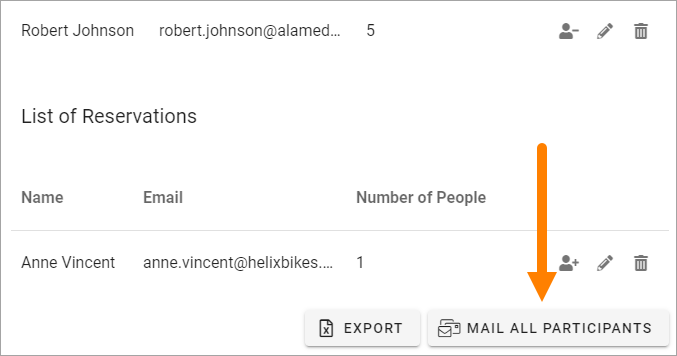

Administer an Event
=======================

There's a number of actions available for Event Managers. These actions are described here. An Event Manager is a colleague with Page Editor permissions, that manages the event on a page. The options are available in Write mode.

If you need to edit properties for an event, you do that in the Page Properties, see the bottom of this page: :doc:`Creating a new event </working-with-events/creating-new-event/index>`

Editing registrations
***********************
You can edit registrations if needed, using these icons:

.. image:: editing-icons.png

Note that these icons are only displayed if you have editing permissions for the page.

When you click the person icon you move the participant, along with all people registered for that person, to the Standby List.

When you click the dust bin, you remove that whole registration.

**Note!** An event can be set up to not have a Standby List. That is selected, and can be edited, in Page Properties.

When you click the pen for a registration, the following can be edited:

.. image:: editing-icons-edit.png

You can add or edit Phone number, decrese or increase number of people associated with this registration, and add a Comment.

Don't forget to save when you're done.

The same actions are available for the Standby List. In this case you use the people icon to move the registration to the Participant list.

**Note!** When a participant is removed from the Participant list, the first colleage from the Standby list is automatically moved to the Participant list, if the associated number of people does not exceed the limit.

Event Management connected to a calendar
-----------------------------------------
If Event Management is connected to an Outlook calendar, a Status column is displayed, indicating if the registered user has accepted the event in his or her calendar, or not. Here's an example:

.. image:: event-management-status-icon.png

In this example, Robert Johnson has accepted the event in his calendar, while Chanel Rosario has not.

Export the list to Excel
**************************
You can export the Participant list to Excel if needed, by clicking this button:

.. image:: editing-excel-button.png

**Note!** With this option you export the Participant list, not anything from the Standby list.

Send e-mail to all participants
********************************
You can send an e-mail to all participants by clicking this button:

The e-mail used is work e-mail.
