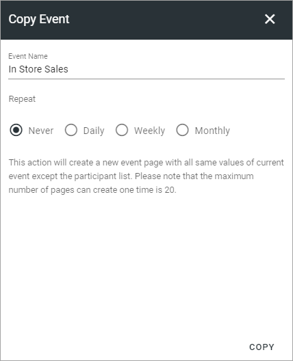
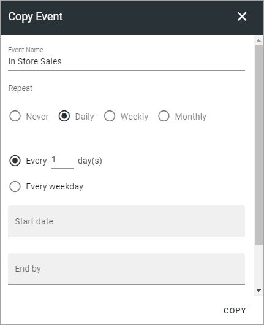
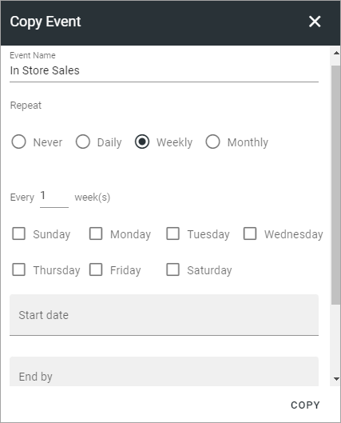
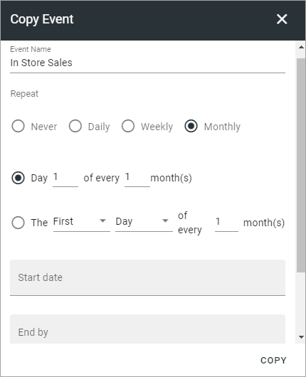

Copy an event
========================================

If you are an event manager (meaning having Editor permissions to the event page), you can copy an event. This can be to either creating a new, similar event or to repeat the event daily, weekly or monthly.

It works this way:

+ If you copy an event without repetition (option Never for Repeat), a new page will be created as a DRAFT. You must then edit the page and publish it the normal way to make the event available.

+ If you copy an event with repeat (daily, weekly or monthly), the copies (pages) are created and published, meaning they are available automatically. Also note that you can't create more than 20 repeat events (pages) at a time.

To copy an event page, do the following:

1. Click COPY EVENT.

.. image:: copy-event-1.png

(If this option is not available, you don't have the correct permissions).

2. Choose what to do and enter settings if needed.

For a draft copy of the event page, no settings are needed.

For Daily, you can set the following:

For Weekly, you can set this:

For Monthly, these settings are available:

3. Click COPY when you're finished with the settings.

