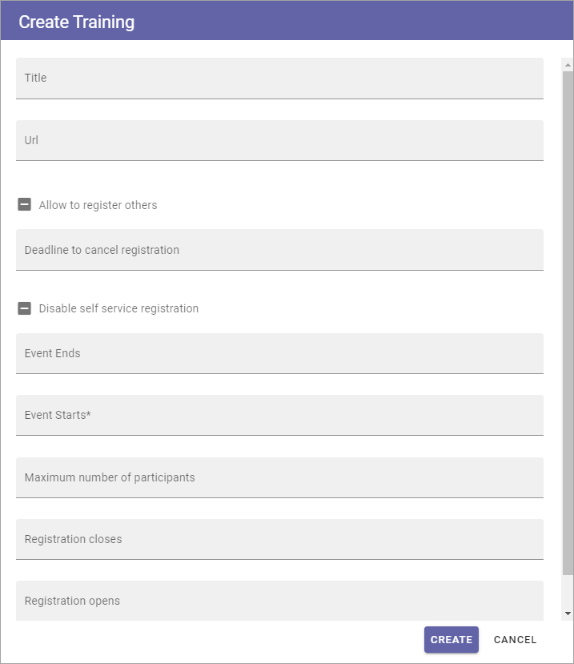

Creating a new Event
======================

**(This documentation is just started. More will be added soon)**

This information is intended for administrators/page editors that needs to create a new event in an Event Centre.

1. Go to the Event Centre.
2. Click the button for creating events.

Something like the following is shown:

3. Fill in the data for the event.

+ **Title**: Add a title for the event here.
+ **Url**: (Info will be added soon.)
+ **Allow to register others**: The logged in user can always register himself or herself and at the same time register a number of not named participants. If any user should be able to register other NAMED participants as well, select this option. This is done through a separate button.
+ **Deadline to cancel registration**: Here you can add a date when it's no longer possible to cancel registrations for the event.
+ **Disable self service registration**: Info will be added soon.)
+ **Event ends**: Add the date for the end of the event.
+ **Event starts**: Add a date for the start of the event.
+ **Maximum number of partpicipants**: Set the maximum number of participants for the event here. This can have two possible effects, depending on how the event is set up; 1. If a wait list is possible, would be participants are listed in the waiting list when this number is reached, 2. If a wait list is not possible, no additional registrations can take place when this number is reached.
+ **Registration closes**: Set the date for the last day registration is possible.
+ **Registration opens**: Set the date for the first day registration is possible for this event.

4. Click CREATE when your done, to create the Event page.

