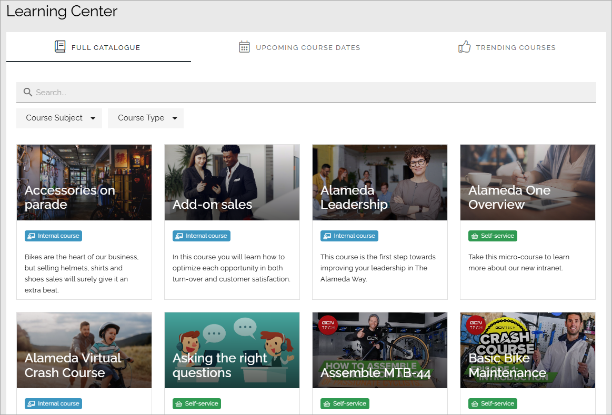
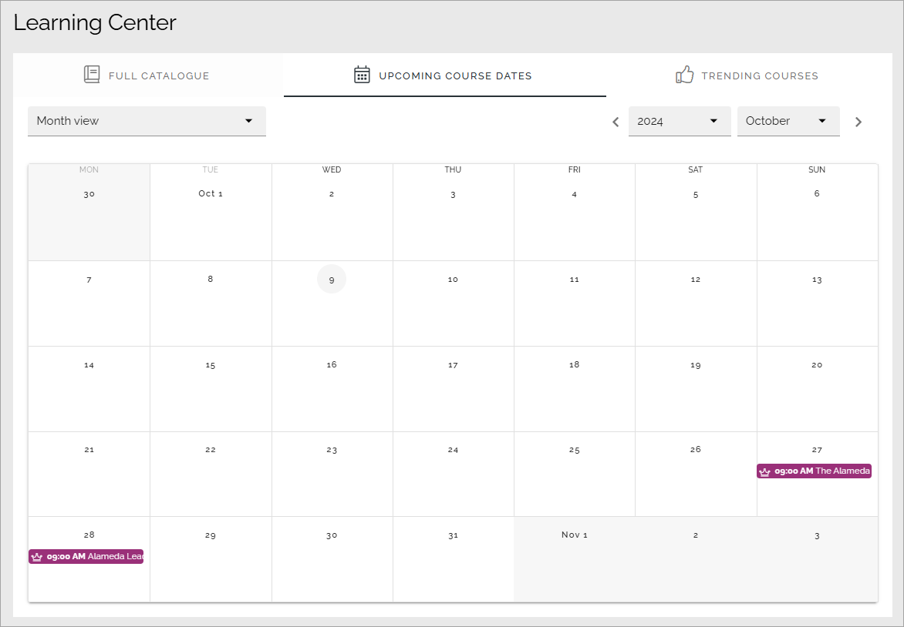
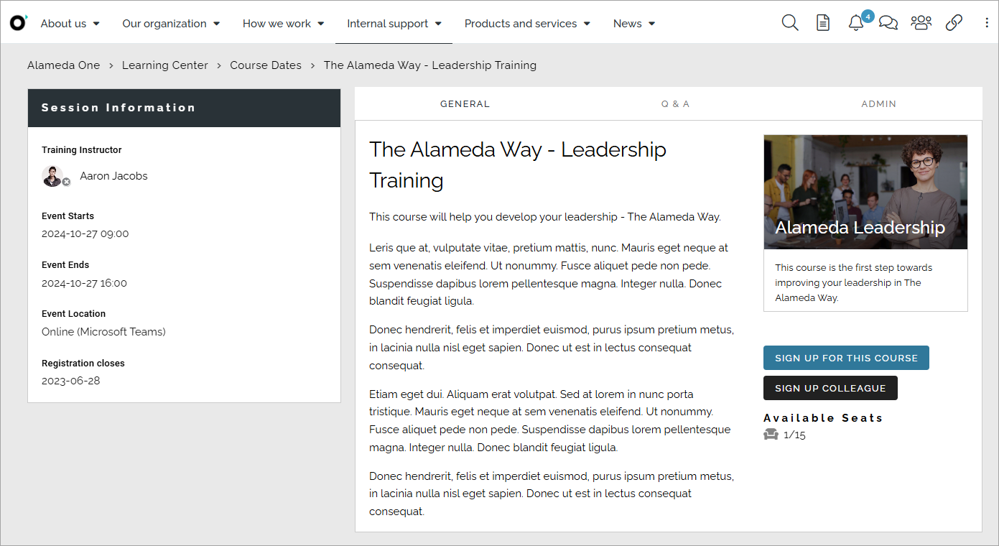
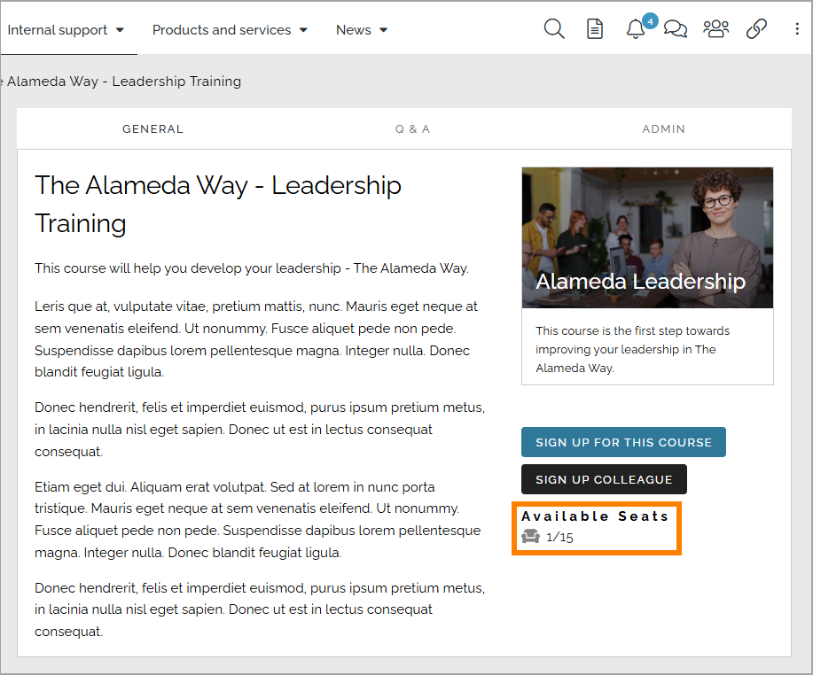
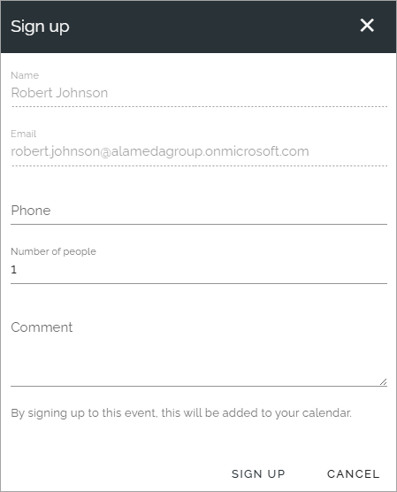
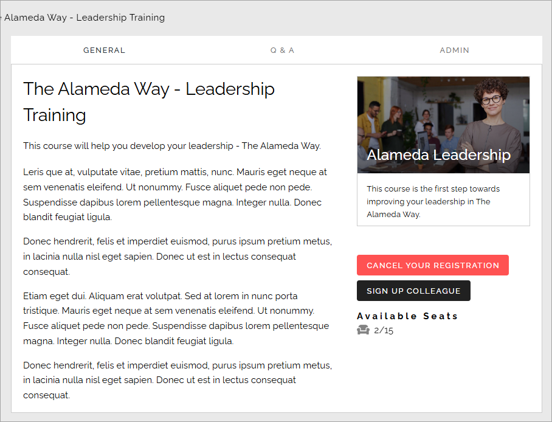
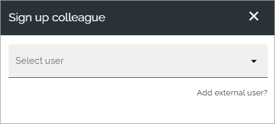

Event management - implementation example
==========================================
Here's an example from a test environment of how Event management can be implemented.

**This page is being updated**

In this example a site for different training events has been set up, both internal, external and online. The landing page is set up with a page rollup.

"Upcoming course dates" displays the upcoming training events in form of a calendar. Different colors are used for the different kinds of training events.

A description of a course (page) can look like this:

There can be three buttons available for registration: SIGN UP, CANCEL and SIGN UP OTHER. The CANCEL button is only shown once the user has registered, which is not the case here. The buttons can of course be named something else, but their purpose is described by their name here. 

Aavailable seats for this course are 15 in total where one has already been taken.

When signing up for this course, the following is shown:

The user can add a phone number, add a number of not named colleagues that will accompany him or her to the course, and add a comment. The rest is filled in automatically.

When the user has signed upp, the sign up button changes to a cancel button:

The information about available seats has also been updated, two seats are now taken.

If signing up a colleage, a list of all users in Omnia is made available. Also note that an external user can be added, by clicking that link.

The settings
***************
The following settings has been used for the pages:

**Not update yet. come back in a day or two.**

Upcoming events
-----------------
This page is the same type of page as for example a news center. 

.. image:: event-implementation-2-new.png

A page rollup block is used, with these settings for Query:

.. image:: event-implementation-query.png

No settings for Social period.

The following settings for Display:

.. image:: event-implementation-display-1.png

To work for event management, View must be set to "Event List" here.

These settings, also for Display:

.. image:: event-implementation-display-2.png

And finally, these Display settings:

.. image:: event-implementation-display-3.png

No settings for Filter and Page variations (other than default).

Settings for the event (Training) Pages
-----------------------------------------
When a manager/page editor creates a new event - meaning a new event page - the following settings are available in this example, and can be edited later:

.. image:: event-implementation-settings-1.png

It is here the manager/page editor adds all data about the event; for example when it starts and ends and the maximum number of participants. Some properties may have to be set up specifically in Omnia admin before they can be used here.

For more information about these options, see: :doc:`Creating a new event </working-with-events/creating-new-event/index>`.

The page type for the event pages consists of a number of blocks. Important to mention is the following:

The buttons in the Action button block must have the type "Event management" to work for this purpose.

.. image:: event-implementation-settings-2.png

The two special event management blocks are set up the following way.

The Event participant counter block:

.. image:: event-implementation-settings-3.png

And the Event participant list block:

.. image:: event-implementation-settings-4.png

More information about the two event management blocks is found here: :doc:`Blocks for event management </blocks/blocks-event-management/index>`

The rest of the sections and blocks used on the page type are set up depending on the information being displayed, by using options available for any page type.

