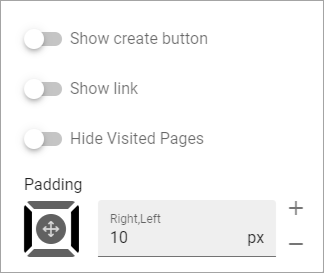
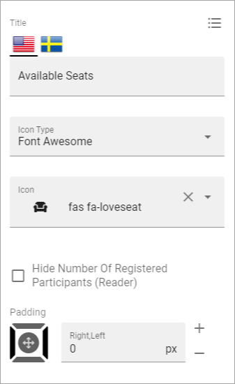
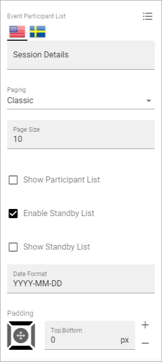

Event Management - implementation example
==========================================
Here's an example of how Event management can be implemented.

In this example a site for different training events has been set up. First there's a landing page set up using banners for navigation:

.. image:: event-implementation-1.png

"Upcoming sessions", lists the training events that users can register for:

.. image:: event-implementation-2-new.png

The button CREATE TRAINING EVENT can only be seen and used by Event Managers (Page Authors).

Each training is described the following way:

.. image:: event-implementation-4.png

There can be three buttons available for registration: SIGN UP, CANCEL and SIGN UP OTHER. The buttons can of course be named something else, but their purpose is described by their name here. 

The reason why the SIGN UP button is not visible above, is because the logged in user already has registered. He or she can then cancel the registration or register other named participants. 

When the logged in user has not yet registered, it can look like this:

(The CANCEL button is not shown until the logged in user has registered).

You can also see that this training event has 20 seats available and is now fully booked.

.. image:: event-implementation-booked.png

Below a list of the registered participants is shown:

.. image:: event-implementation-5.png

As you can see both Joe Bergman and Robert Johnson has registered an additional number of (not named) participants that will accompany them. 

Reservations is possible and there's one name on that list, waiting for the possibility that one of the registered patricipants will not be able to attend.

What we see here is the view for Event Managers (Page Editors). The icons to the right of each registration and the buttons at the bottom are only shown for them. They can use the icons to move a registration to the Standby list, edit the registration, for example to change the number of not named participants, and even remove a registration.

The buttons at the bottom can be used, as the names clearly indicates, to export the participant list to Excel and to send an email to all participants.

The settings
***************
The following settings has been used for the pages:

Upcoming events
-----------------
This page is the same type of page as for example a News Center. 

.. image:: event-implementation-2-new.png

A Page Rollup block is used, with these settings for Query:

.. image:: event-implementation-query.png

No settings for Social Period.

The following settings for Display:

.. image:: event-implementation-display-1.png

To work for Event Management, View must be set to "Event List" here.

These settings, also for Display:

.. image:: event-implementation-display-2.png

And finally, these Display settings:

No settings for Filter and Page Variations (other than default).

Settings for the Event (Training) Pages
-----------------------------------------
When a manager/page editor creates a new event - meaning a new Event Page - the following settings are available in this example, and can be edited later:

.. image:: event-implementation-settings-1.png

It is here the manager/page editor adds all data about the event; for example when it starts and ends and the maximum number of participants. Some properties may have to be set up specifically in Omnia Admin before they can be used here.

For more information about these options, see: :doc:`Creating a new event </working-with-events/creating-new-event/index>`.

The Page Type for the event pages consists of a number of blocks. Important to mention is the following:

The buttons in the Action Button block must have the Type "Event Management" to work for this purpose.

.. image:: event-implementation-settings-2.png

The two special Event Management blocks are set up the following way.

The Event Participant Counter block:

And the Event Participant List block:

More information about the two Event Management blocks is found here: :doc:`Blocks for Event Management </blocks/blocks-event-management/index>`

The rest of the sections and blocks used on the Page Type are set up depending on the information being displayed, by using options available for any Page Type.

