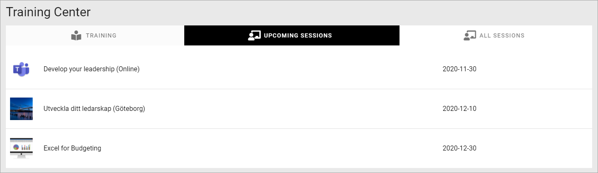

Event Management - implementation example
==========================================
Here's an example of how Event management can be implemented.

**(Just started, more will be added soon.)**

In this example a site for different training events has been set up. First there's a landing page set up using banners for navigation:

.. image:: event-implementation-1.png

"Upcoming sessions" lists the training events that users can register for:

Each training is described the following way:

.. image:: event-implementation-4.png

Normally there's three buttons for registration: SIGN UP, CANCEL and SIGN UP OTHER. The buttons can of course be named something else, but their purpose is described by their name here. 

.. image:: event-implementation-buttons.png

The reason why the SIGN UP button is not visible, is because the logged in user already has registered. He or she can then cancel the registration or register other named participants. (The CANCEL button is not shown until the logged in user has registered).

This training event has 20 seats available and is now fully booked.

.. image:: event-implementation-booked.png

Below a list of the registered participants is shown:

.. image:: event-implementation-5.png

As you can see both Joe Bergman and Robert Johnson has registered an additional number of (not named) participants that will accompany them. 

Reservations is possible and there's one name on that list, waiting for the possibility that one of the registered patricipants will not be able to attend.

What we see here is the view for the administrators/page editors. The icons to the right of each registration and the buttons at the bottom are only shown for them. They can use the icons to move a registration to the reservation list, edit the registration, for example to change the number of not named participants, and even remove a registration.

The buttons at the bottom can be used, as the names clearly indicates, to export the participant list to Excel and to send an e-mail to all participants.

