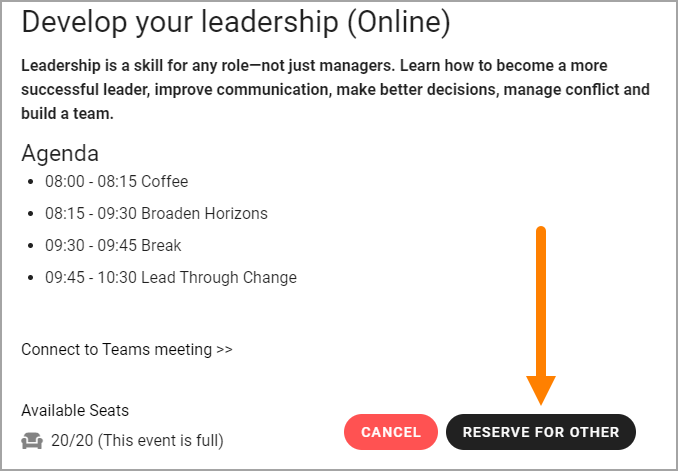

Register for an event
=======================

Information on this page describes the Event options available for all users.

**(This documentation is just started, more will be added soon).**

Register myself and maybe some more
*************************************
Users can always register for an event this way:

1. Click the button for registration, for example:

.. image:: register-for-event-1.png

Something like the following is then available:

.. image:: register-for-event-2.png

The system recognizes the user and adds Name and Email automatically.

+ **Phone**: a Phone number can be added, but it's not mandatory.
+ **Number of people**: Default is 1 but the user can register a number of users that will accompony him or her to the event.
+ **Comment**: A Comment can be added, but it's not mandatory. This field can be used to note information about allergies, food preferences or other information that the organizer of the event may need to know.

Note the information that the event will be added to the person's personal calendar.

An important aspect of registering a number of people here is that the only person that gets the event added to his or her calender is the person registering. If you want to make sure the event is added to all patricipant's calender, use the option to sign up others instead.  

2. Click to save the registration (SIGN UP in this example).

The registration is now added to the list. Here's an exaample:

.. image:: register-for-event-3.png

Register others
*****************
It may be allowed to register others as well. If it is, a button indicating that it is possible is shown, for example:

.. image:: register-other-1.png

The next step is to select user:

.. image:: register-other-2.png

The user can search for colleagues the usual way here. Note that only one participant can be registered each time using this option.

The main difference when using this option instead of just adding a number of people when registering one self, is that in this case, The event is added to the colleagues calendar and when e-mails are sent from the event, colleagues registered this way will receive the e-mails.

(How this works for external participants registered this way will be added soon.)

Add external user
--------------------
External users can be registered using this option. Do the following:

1. Click "Add external user?".

.. image:: register-other-3.png

2. Add information about the external participant:

.. image:: register-other-4.png

3. Add the information needed (see above for field descriptions).

Sign up to Reservation List
******************************
Depending on how the Event is set up, it can be possible to register to a Reservation list when the event is fully booked, in case one of the registered patricipants can't attend. If the event is not set up for reservations, it's simply not possible to register when all seats are taken.

Here's an example how it can look when resevation is possible:

In this example the logged in user has already registered, and therefore no button to register his or herself is available, but the user can still register others to the Reservation List.

The same options as above is available when registering to the Reservation List, as when registering to the Participant List, see above.

Editing ones registration
**************************
A user can always edit the registrations he or she has made. Here's an example:

.. image:: register-edit.png

The user in this case is Adele Vance. She has registered herself and Tony Bergh (using Register Other in the latter case).

She can now use the pen to edit the registrations - all options described above are available - or click the dust bin to remove the registration.

Note that Event Administers can edit or remove any registration, if needed, see: :doc:`Administer and Event </working-with-events/administer-event/index>`

