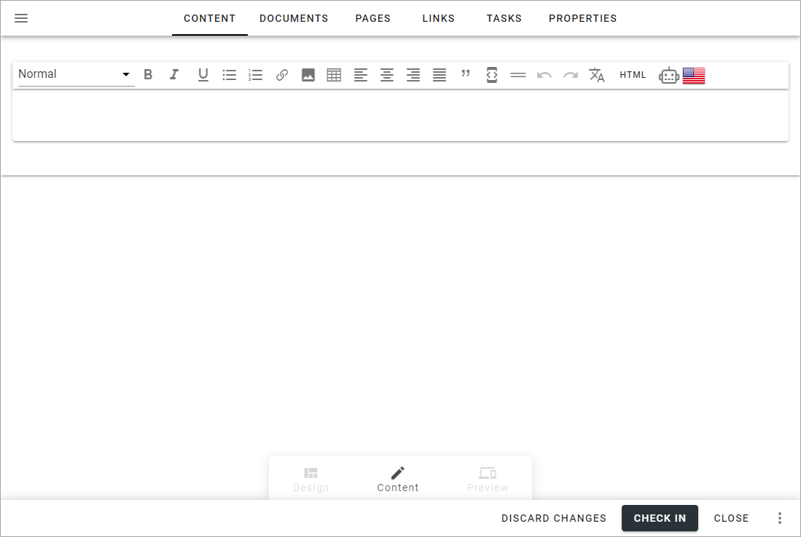

The Content tab - authoring processes in Omnia 7.0
================================================

Use this tab to add a description or other content for the process or process step. You can add the content in any or all available languages.

Available options can differ depending on settings in Omnia Admin, but you can normally work with text and images. Also note that some useful text formatting is available, like section formats and tables.

