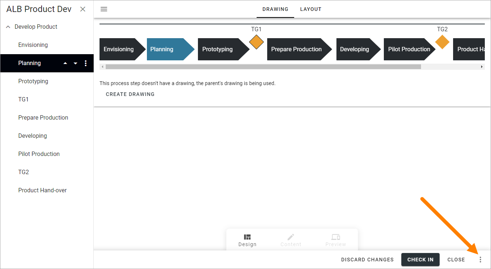
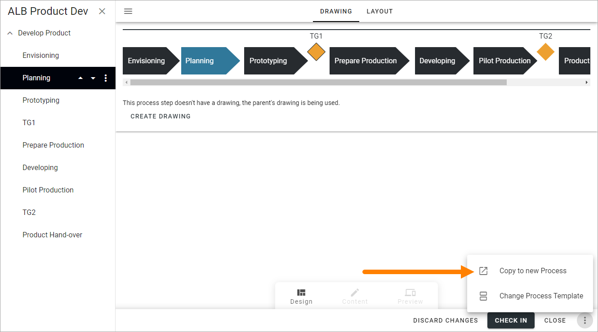
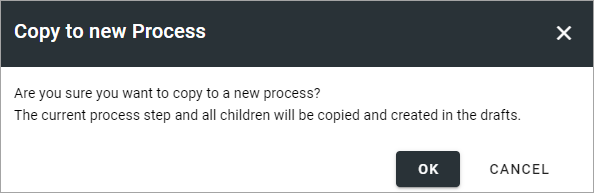
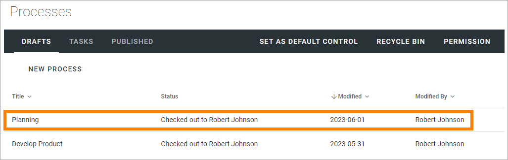

Create a new process from a process step in Omnia 7.0
=======================================================

You can create a new process by copying a process step. If you do, all sub process steps for that process step is also copied. Note that you can not create a new process from a linked process step.

**Important Note!** If the process step uses the parent's drawing, this drawing is NOT copied.

Do the following:

1. Open the draft process in Design mode.
2. Select the process step.
3. Select "Copy to new Process" in the menu.

The following is shown:

4. Click OK to create the new process (or CANCEL to change your mind).

When you click OK, the new process is created and you can work with it the same way as all other processes.

Note that this is a copy, there is no connection between the new process and the process step it was copied from. You can delete the process step or continue to work with it separately.

