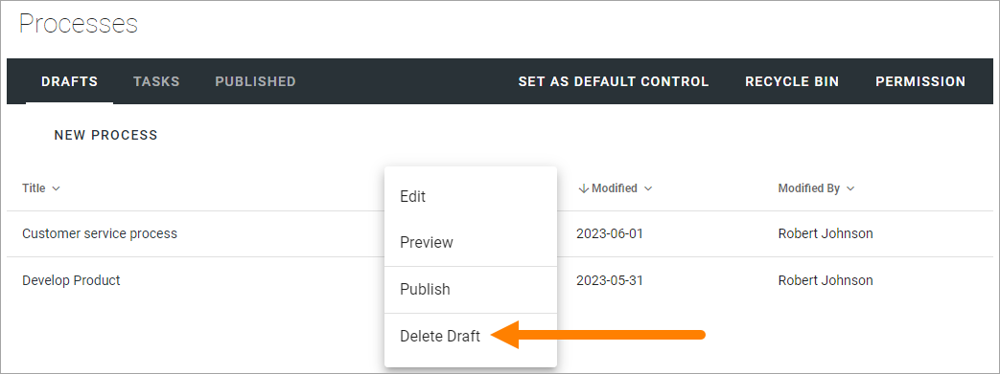
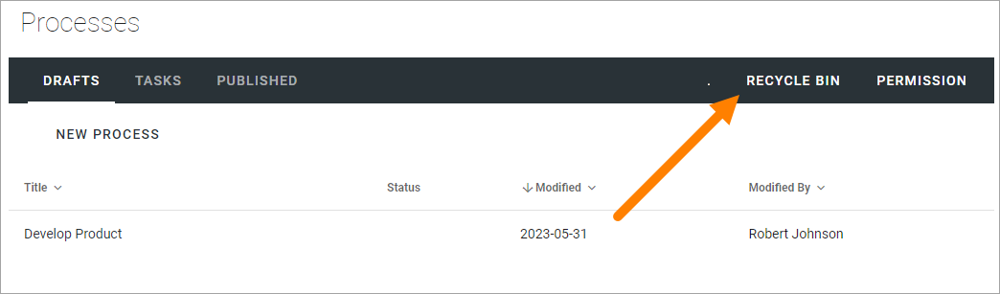
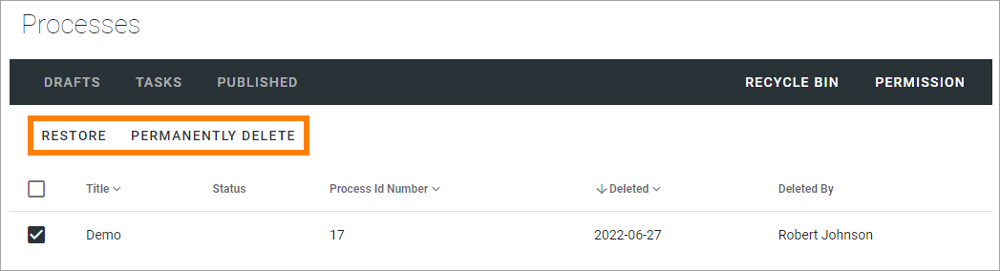

Delete a draft process in Omnia 7.0
================================================

You can delete a draft process. When you do, it's placed in a recycle bin where you can restore it or delete it permanently. 

If you need to delete a draft process, do the following:

1. Select the process in the list.
2. Open the dot menu and select "Delete Draft".

Note that if the process has been published at least once, the last published edition is still available for users, and a new draft can, in that case, still be created from the Published tab.

Restore or permanently delete
*******************************
You can decide to keep a deleted process, restore it or permanently delete it. Note that this recycle bin is a Sharepoint recycle bin so it can depend on Sharepoint settings how long a deleted process can will be kept there.

To handle deleted draft processes, do the following:

1. Select RECYCLE BIN.

2. Select one or more processes.
3. Decide what to do.

