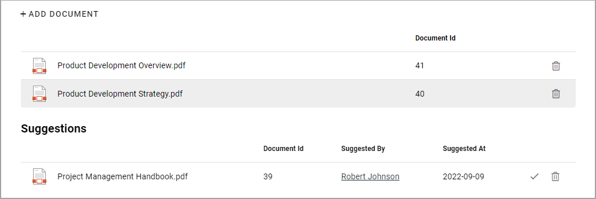

The Documents tab - authoring processes in Omnia 7.0
===================================================

**Important note!** The options for this tab is quite different depending on if the feature "Processes and controlled documents integration" is activated or not. If the feature is activated, the options available are these described on this page.

If the feature is NOT activated, you work with the Documents list as you would with any Document Rollup. For more information, see the bottom of the page.

Use this tab to create a list of controlled documents that are applicable tor the process or process step. The top part of the list displays the documents that already has been related to this process. The second part lists suggestions that authors of controlled documents has made, for example:

You can click the link to read a document.

Add documents
****************
While editing the process, you can always add documents by clicking ADD DOCUMENT.

You then use the Document Picker to find and add documents to the process. More information about how to use the Document Picker is found here: :doc:`Document Picker </general-assets/document-picker/index>`

To remove a document from the list, just click the dust bin for that document.

Resolve suggestions
********************
Any author of controlled documents can suggest that a document should be related to this project, meaning added to the Documents list. It is up to you to accept ot reject the suggestion. You can click the link to read the document. You can also see who sent the suggestion and contact the colleague for further discussions.

You then either accept the suggestion or reject by deleting the document from the list.

For more information on how it works when an author suggests a document to be related to a process, see the heading "Related Processes" on this page :doc:`Working with Published documents </working-with-documents/authoring-controlled-documents/working-with-published-documents`

Create a Document Rollup for the Documents tab
************************************************
If the feature "Processes and controlled documents integration" is NOT activated, you populate the list with documents by creating a document rollup. You use the settings the same way as in the Document Rollup block. For more information, see: :doc:`Document Rollup </blocks/document-rollup/index>`

