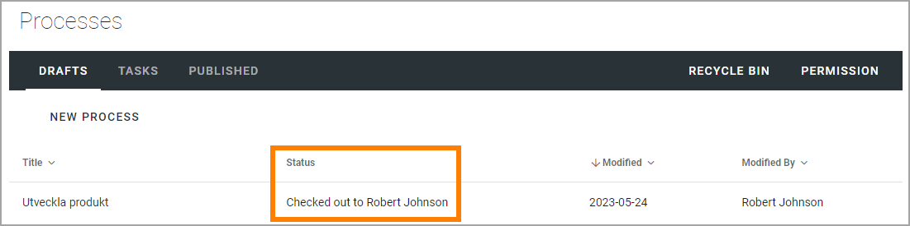
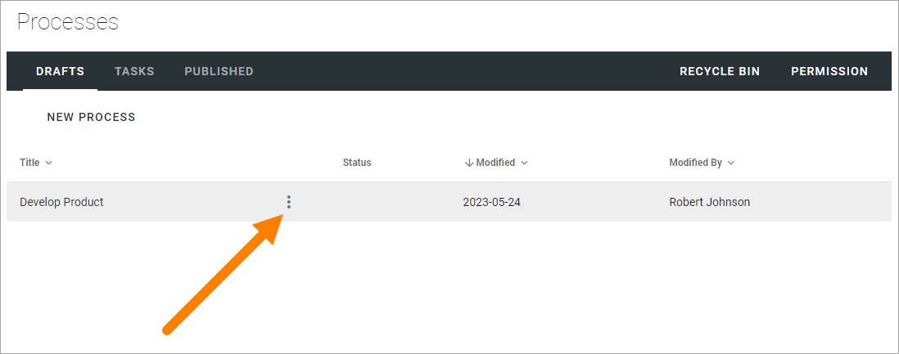
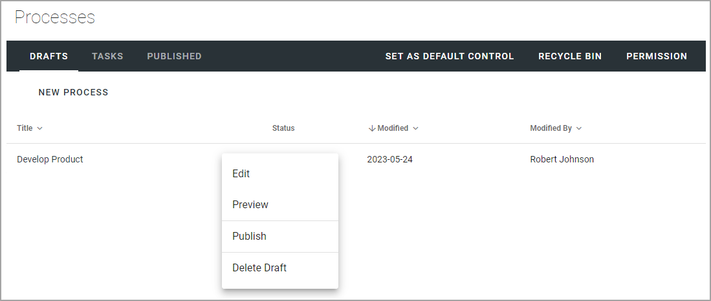

Working with draft processes
=======================================================

"Drafts" is used when creating and editing drafts for new processes or when updating an existing process for a new edition. 

.. image:: drafts-v7.png

When a process is published (approved for publication) it is removed from Drafts and is available on the "Published" tab. 

Process Draft list options
****************************
All active draft processes are displayed in the list and a number of columns are shown. A very important columns is "Status" where messages of the status of the process can be shown, for example if the process is checked out to someone (meaning only that person can edit the process) or if the processes is being published.

Most headings in the Drafts list can be used to sort the list.

There's also a number of options available in the dot menu for a process (point at a process to show the menu):

This is what's available in the menu:

Select section for more information:

.. toctree::
   :titlesonly:

   creating-draft-process-v7/index
   using-workspace-for-processes/index
   drawing-tab-authoring-processes/index
   content-tab-authoring-processes/index
   documents-tab-authoring-processes/index
   pages-tab-authoring-processes/index
   links-tab-authoring-processes/index
   tasks-tab-authoring-processes/index
   edit-properties-authoring-processes/index
   create-new-draft-from-published-process/index
   copy-process/index
   save-check-in-discard-authoring-processes/index
   preview-process-authoring-processes/index
   edit-a-process/index
   delete-a-draft-process/index
   create-new-process-from-process-step/index
   

