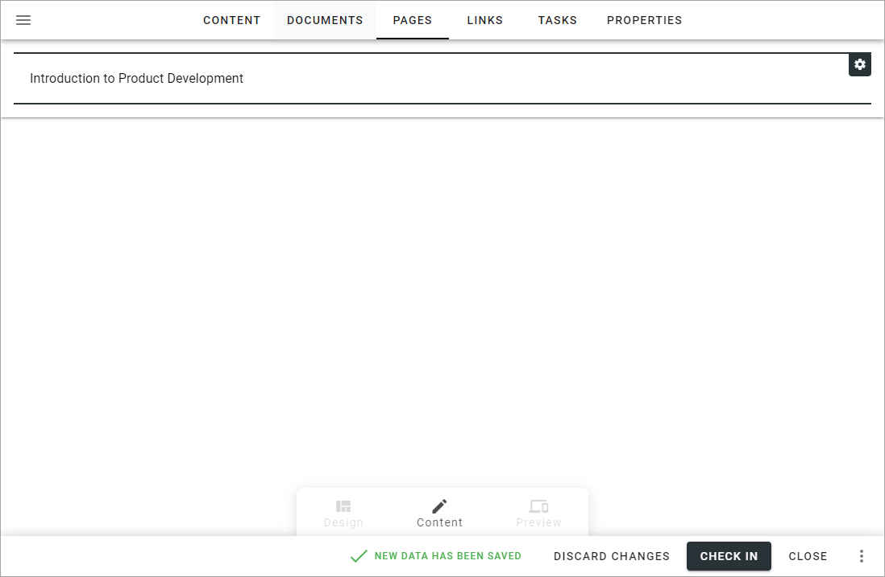

The Pages tab - authoring processes in Omnia v7
==================================================

Here you can create a Page Rollup with pages that are relevant to the process, the information ob this page applies to Omnia 7.0 and later.

You use the settings the same way as in the Pages Rollup block. For more information see: :doc:`Page Rollup </blocks/page-rollup/index>`

