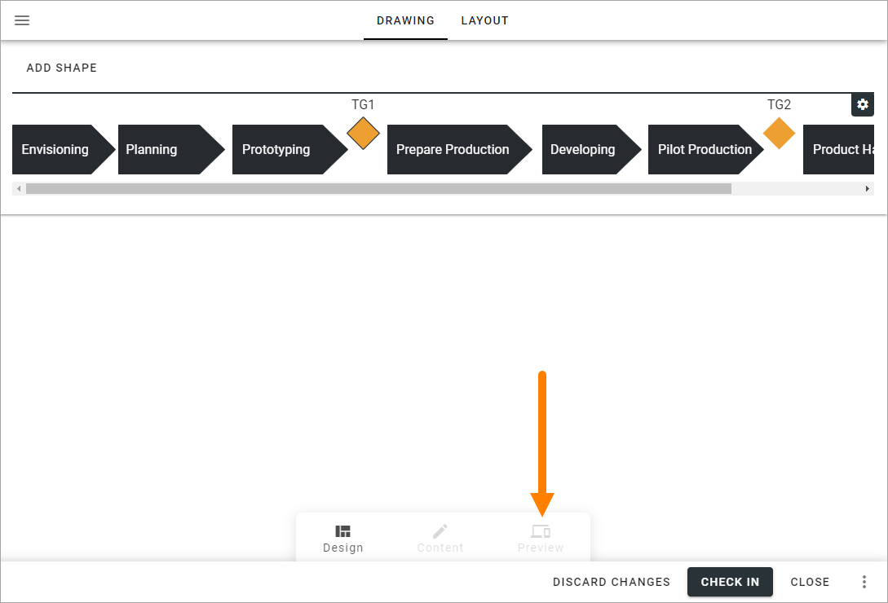
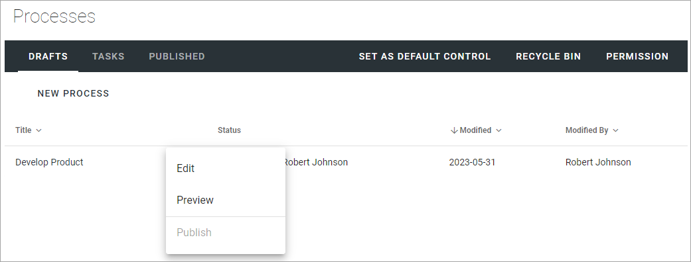
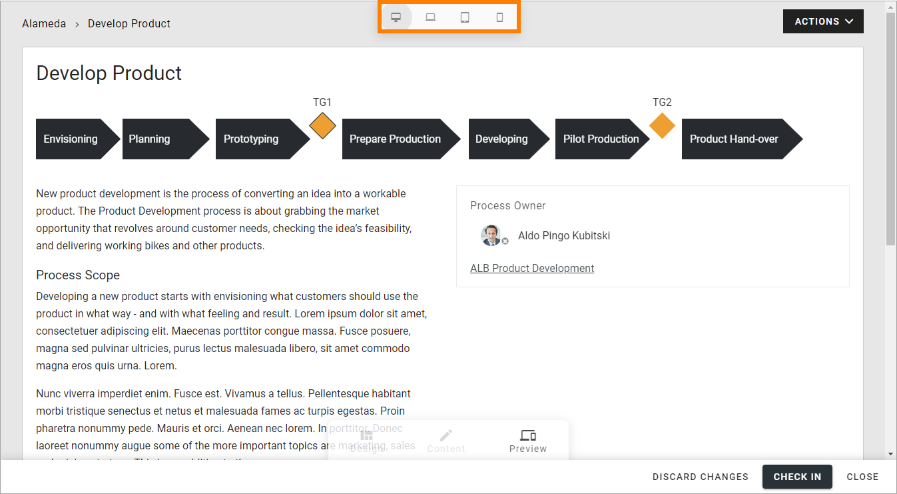

Preview a process when authoring
================================================

While you're working on a draft process the first thing you'll see is a preview of your work so far. You can also, whenever you need during the editing, enter Preview mode by clicking here:

You can also preview the process without editing, this way:

1. Open the dot menu for the process.
2. Select "Preview".

When in Preview mode you can test how the process will look on different devices:

Important note about preview and different devices
---------------------------------------------------
Although you can select different devices in the preview, it's important to know that there's no scaling. The process canvas is always diplayed in 100%. The preview will show how much of the canvas that will be shown on different devices without scrolling.

