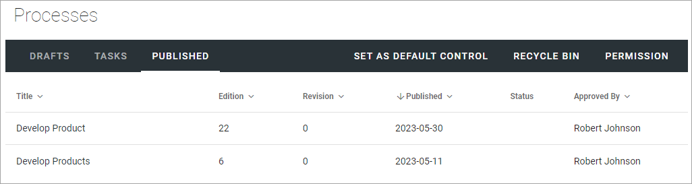
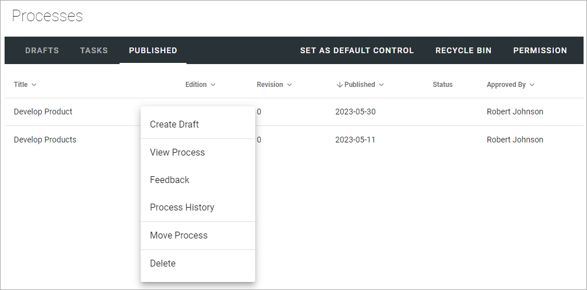
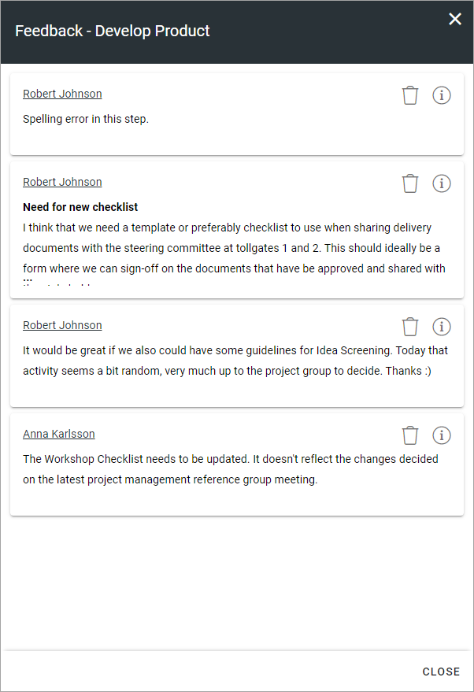
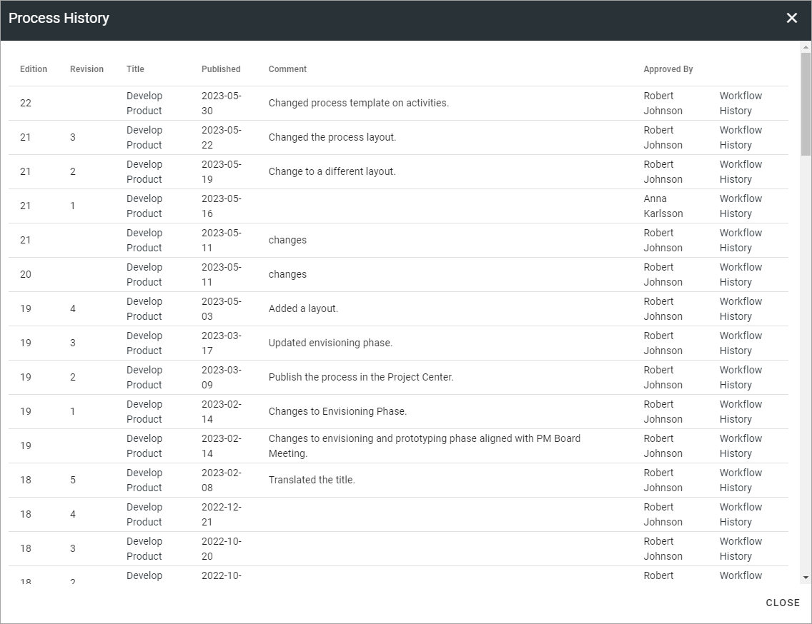
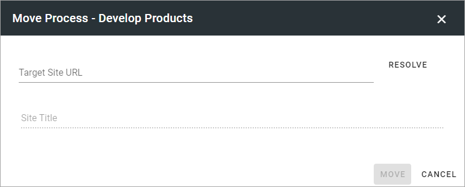
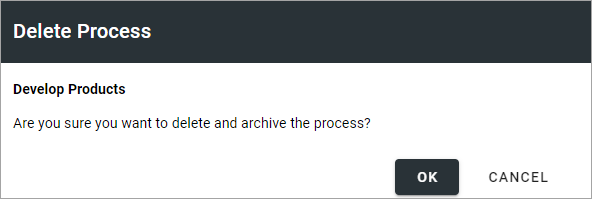
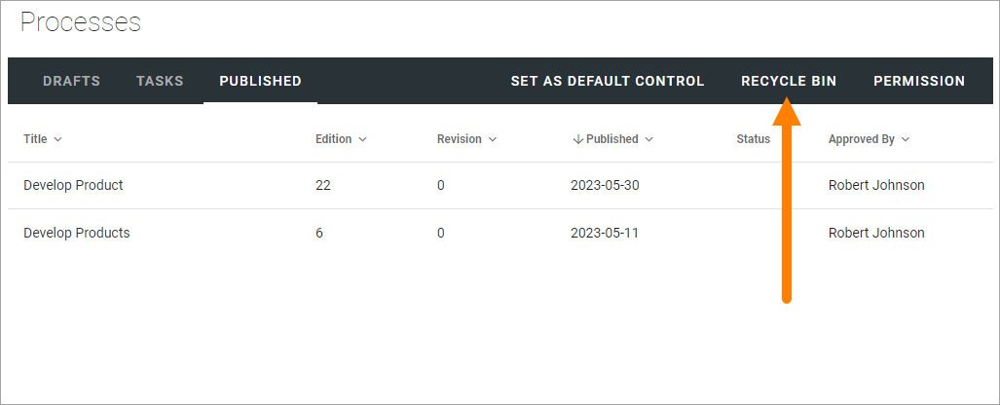
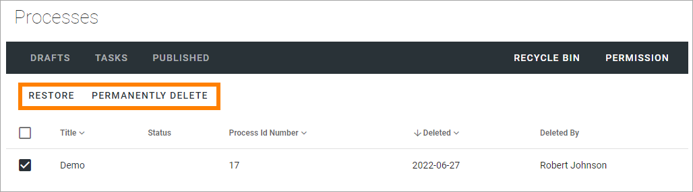
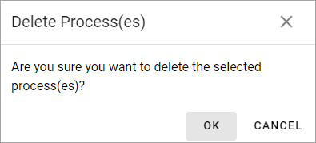

Working with published processes in Omnia 7.0
=======================================================

**This documentation is ongoing.**

The Published tab lists the latest edition of all published processes from this Processes library. 

All options are found in the dot menu for a process:

Create Draft
**************
You can create a new Draft from a published process and start working on the new edition when you need it. The existing edition is still available for users until it's replaced, when the new edition is published.

For more information on how to create a new draft, see: :doc:`Create a new draft from a published process </working-with-processes-v7/authoring-processes-v7/working-with-drafts-processes/create-new-draft-from-published-process/index>`

View Process
*******************
Use this option to go the page set up to where end users can acccess the process. If no page has been set up yet, the process is shown on a system fallback page.

Feedback
*********
An Action Button can be set up to make it possible for users to send feedback on a process. Such feedback will be sent to the process owner and will be available through this option.

Here's an example from a test environment:

For more information on how to set upp Action Buttons, see: :doc:`Action Button </blocks/button-link/index>`

Process History
******************
There’s information about each published edition available. 
 
Here's an example from a test environment:

 
You can see the publication date for each edition, the author’s comment, if any, and who the process was approved by. You can click the link to view the edition of the process.

Move Process
***************
A process can be moved to any other Team Site, if needed. **Note!** If a draft has been created from the process, it can't be moved. In that case you have to delete the draft first.

Here's how:

1. Go to the target Team Site and copy the Url.
2. Go to the source Team Site and click the dot menu for the process.
3. Select "Move Process".

The following is shown:

4. Paste Url to the target Team Site, or type the Url if you haven't copied it.
5. Click RESOLVE.
6. If the Url is correct, the name of the target Team Site should now be shown.
7. Click MOVE.

Delete or restore a published process
****************************************
A published process that has a new draft can't be deleted, the draft must be deleted first.

When you delete a process, you get a chance to change your mind:

If an archive for processes is set up, the process is placed in the archive. It's also placed in a local (= for the site) recycle bin. 

If needed, an administrator can restore a process from recycle. When a process is restored, a draft is created in Drafts as a new edition, and can then be edited and published the normal way. 

A restored process keeps it's id number and the history for the process is retrieved as well. It's noted in the history that the process has been deleted and restored (if that happened).  

The recycle bin for published processes is found here:

Here, processes can be restored or permanently deleted. Select one or more processes and select option.

If you choose to permanently delete a process, you get a chance to change your mind:

If you choose to restore a process, a draft is created and you can work with it exactly the same way as any other draft.
