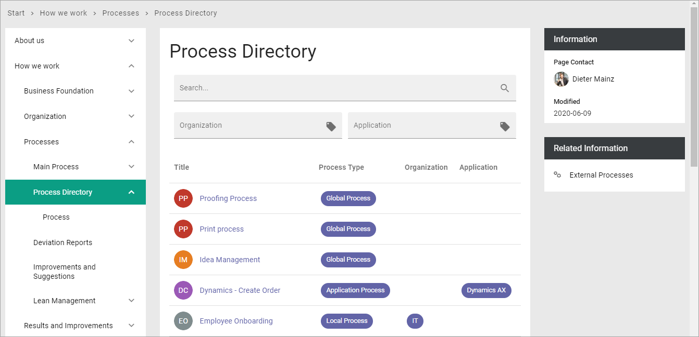
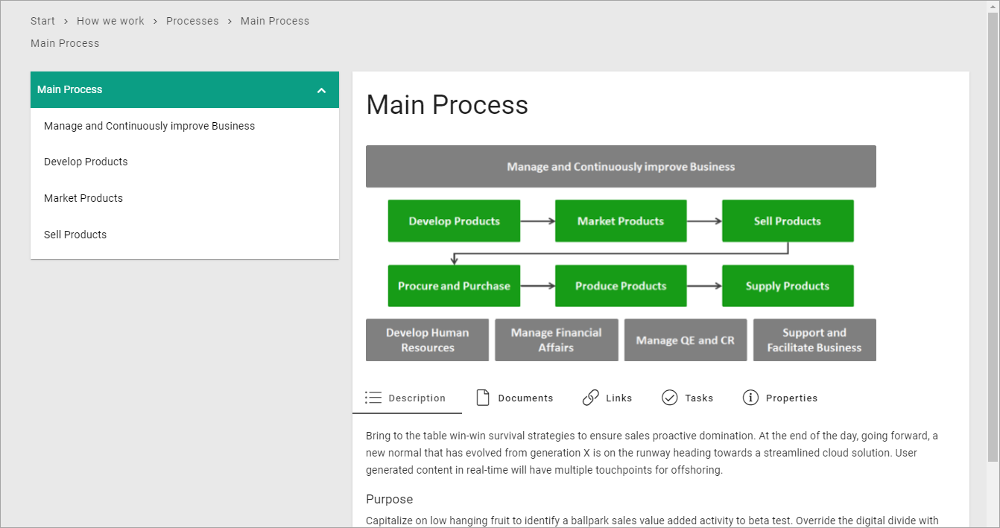

Displaying processes for users in Omnia v7
================================================

When considering how to display processes for end users in Omnia 7.0 and later, you can use one of these approaches, or a combination of them:

+ Add a page and place a Process Rollup to list available processes.
+ Add a separate page for every process and use a suitable Page Type.

Using a Process Rollup
*************************
If you use a Process Rollup you don't have to create separate pages for the processes. When a user clicks a process in the Process Rollup, a system page is then used to display the process.

Here's an excample of a page with a Process Rollup:

For more information on how to set up a Process Rollup, see: :doc:`Process Management </blocks/process-blocks/process-rollup/index>`

Creating a page to display a process
**************************************
If you decide to add a separate page for each process you should create a Page Type for that use. 

.. image:: process-image-type.png

When creating such a page, you HAVE to set the process to be displayed. You do that on the Properties tab of the page.

.. image:: process-properties.png

Here's an example of a process displayed with a Process Page Type:

Other than selecting a process as the property, you work with the page the same way as any other page.

For more information on how to work with pages, see: :doc:`Pages </pages/index>`

For a list of all Process blocks, see: :doc:`Process blocks </blocks/process-blocks/index>`

