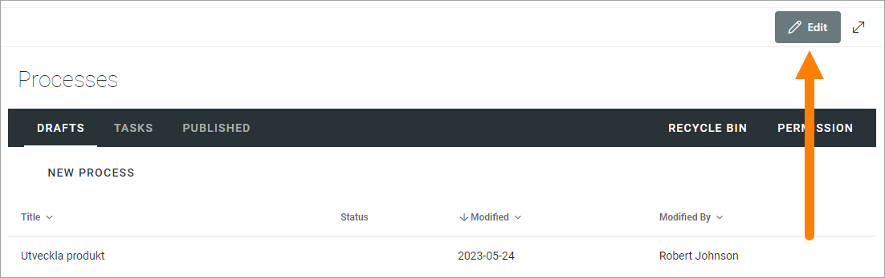
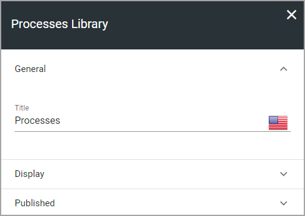
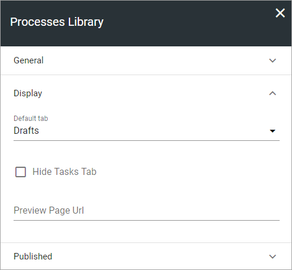
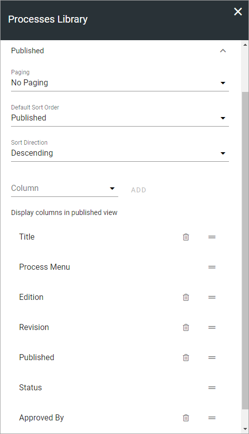
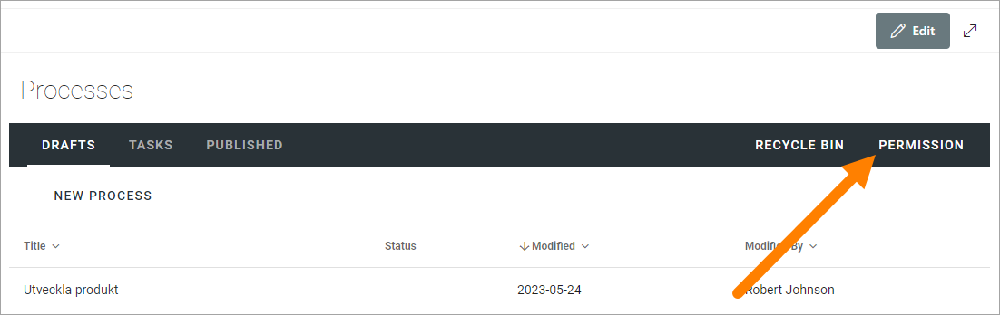
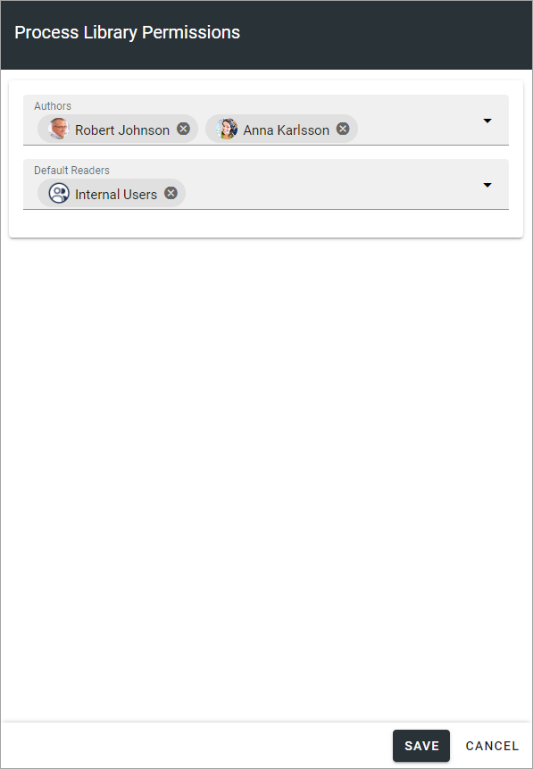

Processes library settings in Omnia 7.0
================================================

**This documentation is ongoing.**

You must be Administrator of the Team Site, to be able to edit the settings for the lists in the Processes library, and to edit permissions.

Settings for the tabs
***********************
To access the seetings, go to the Processes library and click "Edit". 

General
-----------
Here you can edit or add a Title for the list in any or all languages available for the tenant. The default language is mandatory:

Display
----------
Here you can set the following:

+ **Default tab**: Decide which tab will be shown when an author enters the library.
+ **Hide Tasks Tab**: If the Tasks tab should not be displayed for authors, select this option.
+ **Preview Page Url**: You can add the Url to a page to be used for process previews here. If you don't, a default Omnia page will be used for previews.

Published
--------
The following settings are available for the Published tab:

+ **Paging**: You can choose between no paging or classic paging.
+ **Default Sort Order**: Select the column for default sort order for the list.
+ **Sort Direction**: Select Descending or Ascending for the default ordering field here.
+ **Column**: Use this option to add a column to be shown. Open the list, select the column and click "ADD".
+ **Display columns in published view**: Here you selected how the columns are listed. To remove a column click the dust bin. If no dust bin is shown for a column it's mandatory, and therefore can't be removed. You can set the order of the columns by grabbing the the icon to the far roght for the column, and drag it to another place in the list.

Permissions
************
If Process Management is set up for using permission groups, you can, as an Administrator (Owner) of the Team Site, edit these permissions.

**Note!** Permissions for the Processes Library is NOT inherited from the Team site's permissions, they are always separate. **Also Note!** Omnia only users can't be added here.

Do the following:

1. Click "Permissions" in the Processes library

Something like the following is shown:

You add/remove groups and/or users to these fields the same way as other people filds.

Note that external users that has been invited in the Azure AD can be added here as well. Users invited this way can log in with their own Microsoft 365 account.

