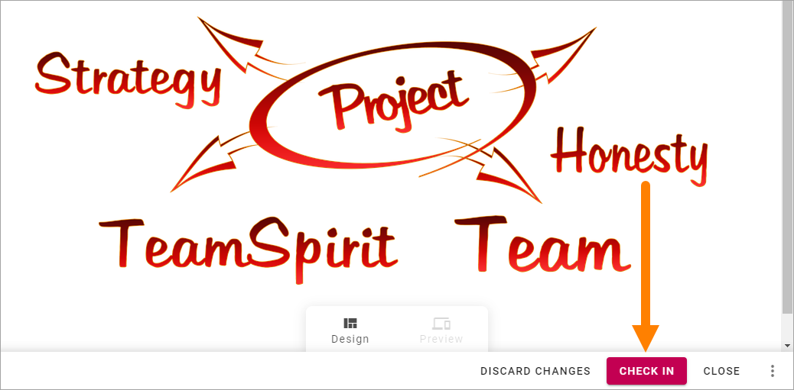
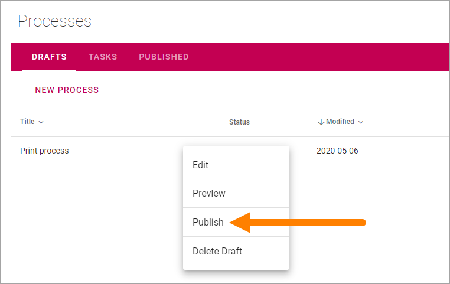
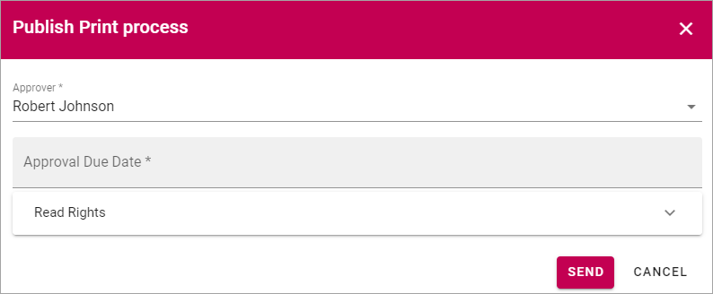
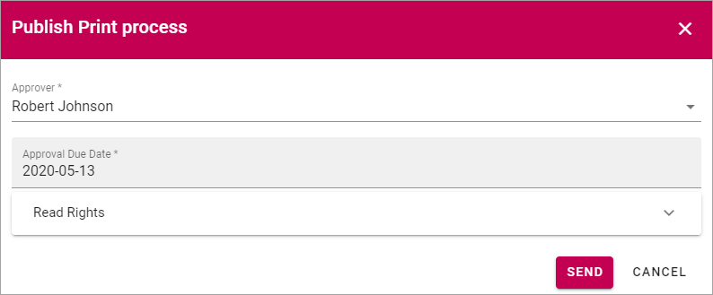
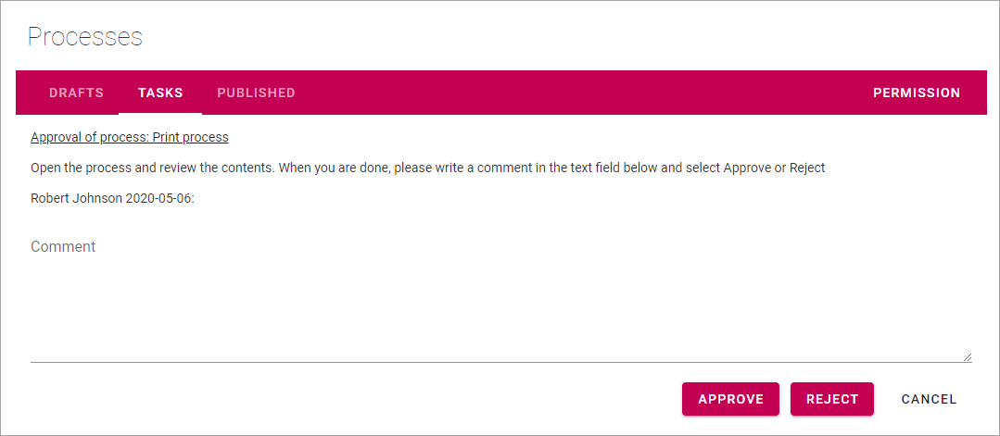

Publish - the approval workflow for processes
================================================

When a process has reached a final version, it must be published, and if approval is activated, be approved for publication, to be available for end users. To do that, you start an Approval Workflow.

The process must be checked in and all metadata must be properly set before the Approval Workflow can be started. Some metadata can be mandatory. If all mandatory metadata has not been added, the Approval Workflow can not be started. 

**Note!** Metadata can also have impact on who is available as approver.

Also note that, if it's the first time the process is published, a page needs to be set up, with use of the process blocks, to make it possible for end users to access the process.

To publish a process, do the following:

1. Check that all metadata (Properties) are correct.

2. Check in the process.

3. Open the dot menu for the process and select "Publish".

Something like the following is shown:

Exactly which options are available here depends on a a number of settings. These are the common ones:

+ **Approver**: You select one approver from the list, or accept the suggested. Available approvers depends on various settings and how the system is set up.
+ **Approval Due Date**: Here you add a date when the approval should be made, at the latest. This is just information for the approver. The Approval workflow is not stopped if this date is passed.
+ **Comments**: Use this field for comments about what was edited/added in a new edition. The field is not shown when the first edition is published.
+ **Read rights**: The default selection is to use the Default Readers Group from the site’s permissions. If, for some reason, the Read Rights for this particular document should be different, you can select "Limit Read Access", and enter the names of the readers, or any group memberships, for example AD groups.

4. Select approver and add a due date.
5. Click "Send".

When you click "Send", a task is created for the approver, and an e-mail is sent, with a link to the draft process. The task can look like this:

 
The approver automatically has read access to the process, meaning the approver can use the Preview mode only, until the task is completed. If a Notification Panel is set up for Tasks, the approver is also notified in the notification panel, and can choose to open the task from there. 

The workflow will be active until the task is completed and the process will be locked for editing during that time. This is noted by the message "Waiting for approval" in the Drafts list:

.. image:: waiting-for-approval.png

Approved or Rejected
*********************
If the process is approved for publication, it’s now available for readers. You, the author, will receive an e-mail stating that.

If it’s rejected, there’s some changes the approver would like you to do. You will receive an e-mail stating that the process was rejected and a message from the approver. After changes has been made, you start a new Approval Workflow the same way as before.
