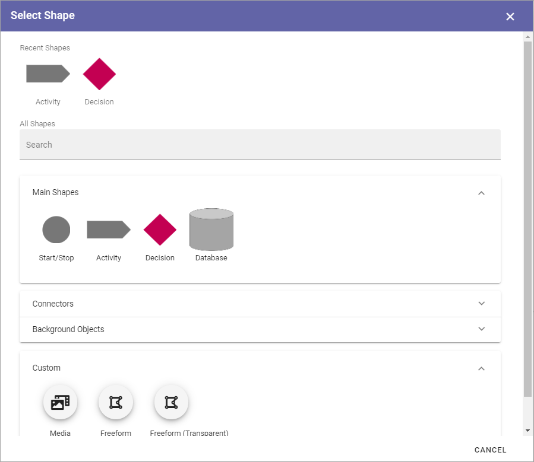
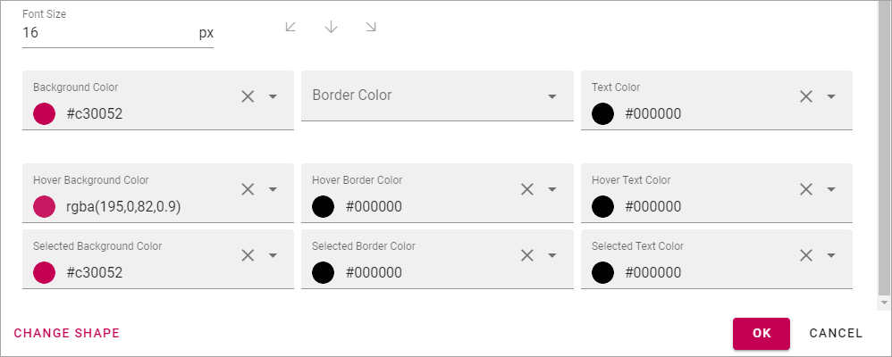
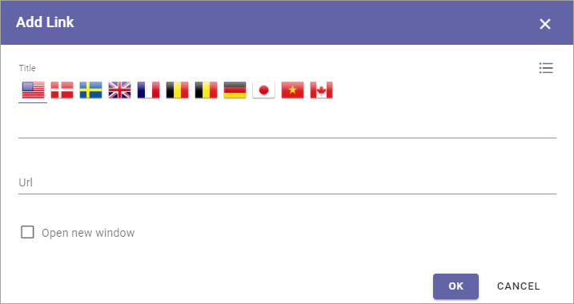
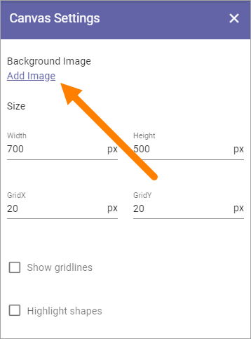
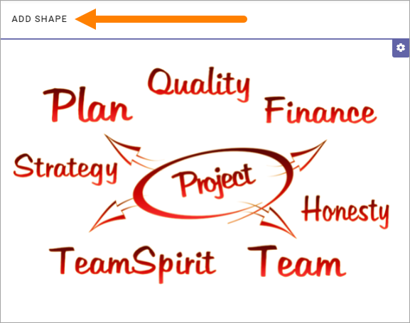

The Drawing tab - authoring processes
========================================

You use this tab to visualize the process or process step.

Canvas Settings
****************
To open the canvas settings, click the cog wheel.

.. image:: pm-drawing-canvas-1-new.png

Here you can set the following and you can edit these settings anytime.

.. image:: pm-drawing-canvas-2-new.png

+ **Add image**: Click here to add a background image (see below).
+ **Width/Height**: Set the size of the work area in pixels here.
+ **GridX/GridY**: The work area has a grid that shapes and clickable areas snap to. You set the size of a square in the grid here.
+ **Show gridlines**: Select this option if you want the grid lines to be visible. 
+ **Highlight shapes**: Select this option to display an outline around the shapes. This can be useful if, for example, the shapes color is similar to the background image. Another example is when creating transparent, clickable areas, see below.

Here's an example with grid lines visible:

.. image:: pm-drawing-canvas-3new.png

If the whole grid can't be displayed, icons for scrolling are shown, for example:

.. image:: pm-drawing-scrolling.png

**Very important!** The canvas setting is the same for all devices so you have to consider what canvas size is the most user friendly for the devices most commonly used in your organization for accessing the process. 

Working with shapes
*********************
To add a shape, click ADD SHAPE.

.. image:: pm-addshape-new.png

Something like the following is shown:

Exactly what is available here depends on settings for the Process Type, so this is just an example. For more information see: :doc:`Process Types </admin-settings/tenant-settings/process-management/process-types/index>`

+ **All Shapes**: If the list of shapes is very long, you can use this field to search for a shape.

Custom shapes may not be allowed at all. If custom shapes are allowed "Freeform" means you, the process author, can draw a new shape when needed. "Media" means you can upload an image to use as a shape for this process or process step. A transparent Freeform is practical to use for clickable areas.

Settings for a shape
----------------------
To select a shape, just click it and the following settings is shown:

.. image:: pm-drawing-shape-settings-settings-new.png

+ **Shape type**: Here you decide what to use the shape for. Process Step is the default. You can also choose "None", which means it's just an image; "Linked process" and "Link". All selections except "None" creates a clickable shape. See below for more information. Note that to be able to create a linked process, other processes must already exist, to link to. 
+ **Process step**: If you already have created the process steps, select the process step to go to when the shape is clicked, using this list.
+ **Select process**: When you have selected "Linked process" in the top list, use this list to choose the process to link to.
+ **Add link**: When you have selected "Link" in the top list, this option is shown. See below for more information.
+ **Title**: Add the text that should be displayed for the shape here, if a text should be displayed. You can see a preview to the right. You can add the title in any or all available languages.
+ **Text position**: Set the position for the text: "On Shape", "Above shape" or "Below shape".
+ **Text alignment**: Set text alignment here: "Center", "Left" or "Right".
+ **Text adjustment**: Use the arrows to fine tune the placement of the text. Use the center icon to center the text.
+ **Show more settings**: Click to show the following settings:

+ **Font size**: Set the font size in pixels for the text here.
+ **Tooltip text**: You can add a Tooltip text, which can for example be used to add an explanation of a process step. This text is shown when a user points at the shape.
+ **Colors**: Use the options in this section to set details for colors, for the shape and text. Note that you can set colors for three states of the shape: not selected, selected and hovered.

When you have selected "Link" as Shape Type, you can click "Add Link", and can use the following settings:

+ **Title**: Add a title for the link (default language mandatory).
+ **Url**: Add or paste the URL and decide if the link should be opened in a new window or not.

Click OK to save the shape. Click CHANGE SHAPE to go back a step to create an additonal shape. The changes you have made and not saved are discarded. Click CANCEL to exit.

.. image:: pm-drawing-shape-settings-save-new.png

If you created process steps when adding shapes, you can now see that they are listed in the navigation.

.. image:: pm-drawing-process-step-new.png

You can use the tabs to edit the process steps.

Adjust the shapes
-------------------
Note that when you add a new shape it's placed in the upper left corner of the canvas, and text above may not be seen. If that is not the intended position, use drag and drop to place the new shape. You can place a shape anywhere within the canvas.

To adjust the size of the shape, click it and use the handles to drag to the desired size.

.. image:: pm-drawing-shape-size-new.png

Edit a shape
--------------
To edit the settings for a shape, click the shape and then click the pen.

.. image:: pm-drawing-shape-edit-new.png

When you edit a shape for a process step, note that you can edit ALL settings for the process step in the Shape Settings, for example:

.. image:: pm-drawing-shape-edit-tabs-new.png

For more information on how to use the tabs, select links at the bottom of this page: :doc:`Working with drafts </working-with-processes/authoring-processes/working-with-drafts/index>`

Clone a shape
---------------
If you need a number of shapes that are similar, this is a handy option.

1. Select the shape you want to clone.
2. Click CLONE SHAPE.

.. image:: pm-drawing-shape-clone-new.png

3. Select the new shape to change settings as needed.

(Note that the cloned shape may be placed on top of the "mother" shape. You may have to move the new shape to see it.)

Delete a shape
----------------
To delete a shape you no longer need, do the following.

1. Select the shape.
2. Click DELETE SHAPE.

.. image:: pm-drawing-shape-delete-1-new.png

The following is shown:

.. image:: pm-drawing-shape-delete-2-new.png

3. Click OK to delete or CANCEL to change your mind.

Create a drawing for a process step
**************************************
Regarding a drawing for a process step, the default setting is that the main process drawing (the "parent drawing") is used. If you want to create a drawing for a proces step, do the following:

1. Select the process step.

.. image:: select-process-step-new.png

2.Click CREATE DRAWING.

.. image:: create-drawing-new.png

Now you can work with the process step's drawing as described above.

Add a background image
***************************
The option for adding a background image is also available in the canvas settings. You can use this option either for just a nice background image, to place shapes on, or to upload a process image you have created in for example PowerPoint or Visio, to add clickable areas on. For more information about clickable areas, see below.

To add a background image:

1. Open the canvas settings.
2. Click "Add image".

The media picker opens and you use it to upload an image from your computer or from any of the available resources.

For more information on how to use the media picker, see: :doc:`Media picker </general-assets/media-picker/index>`

**Note!** When you upload a background image, the canvas size adjusts automatically.

Adding clickable areas to a drawing
-------------------------------------
If you have uploaded a drawing you can place clickable areas on that drawing, to go to process steps and more.

**Important note!** To be able to add clickable areas, the process type must contain Freeform.

**Tip!** Activating "Highlight shapes" in the grid settings can be useful when working with clickable areas.

1. Click "Add shape".

2. Click "Freeform".

.. image:: clickable-2-new.png

In this example the administrator has prepared a Freeform suitable for clickable links - Freeform (Transparent). So in this case, that shape is selected, otherwise it would be Freeform.

3. Edit the settings for the shape, see the heading "Settings for a shape", above. Note, here you set what will happen when the area is clicked.

**Tip!** You probably don't want any colors for the clickable area, or maybe just a border color when the mouse hovers over the area. Click "Show more settings" to edit the colors.

4. Click "Draw shape".

.. image:: clickable-3-new.png

The drawing is now shown with the grid on top.

5. Click to set the start corner, move the mouse to the next corner and click to set it ... continue this way until you have "painted" the shape.
6. Set the shape by clicking at the start corner once more.

You now have the first clickable area in place and what is opened when a user clicks it depends on the setting in step 3. (In the image below "Highlight shapes" is on in the Canvas Settings.)

.. image:: clickable-5-new.png

7. Click "OK" in the grid window.
8. Click "OK" for the shape settings.

To add additional clickable areas you have to go back to step 1, but there's a neat trick if you are adding several clickable areas with the same shape. A quick way of adding additional steps is this:

9. Select the shape.
10. Select CLONE SHAPE.

.. image:: clickable-6-new.png

10. Edit the settings for the copy (clone) and save.
11. Move the new clickable area to the correct position and save (Check in).

Change the size of a clickable area or move it
--------------------------------------------------
To change the size of a clickable area, do the following:

1. Click the area.
2. Use the handles the resize the area.

Note that you rotate the area using this handle:

.. image:: clickable-7-new-frame.png

To move a clickable area, just use drag and drop.

Edit settings for a clickable area
-----------------------------------
To edit settings for a clickable area, do the following:

1. Click the area.
2. Click the pen icon.

.. image:: clickable-8-new-frame.png

3. Change the settings and save.
