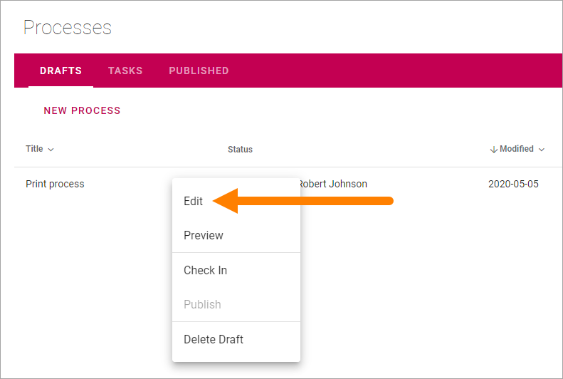

Edit a process
==================

To edit a draft process, just click the Title in the list, or select "Edit" in the process's dot menu.

If you click the process title, the process is shown in Preview mode. You have to click "Design" to edit the process.

.. Image:: edit-process-1.png

If you select "Edit" in the dot menu, the process is opened in Design mode.

The same options are available when you edit a draft process as when creating one.

If the process is published you will have to create a new draft from the published edition, to be able to edit the process, see: :doc:`Create a new draft from a published process </working-with-processes/authoring-processes/working-with-drafts/new-draft-from-published/index>`