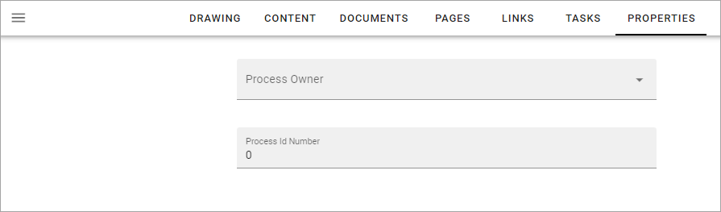

Edit properties when authoring processes
==========================================

The other tabs you can use when editing a process is available for the main process and for process steps. On this tab you set properties for the whole process. Therefore the tab is available at the top level only.

Any set of properties can be shown here. Available properties are set up by the administrator creating the process type. Here's a simple example:

Property sets for processes can be set up in Omnia admin, see: :doc:`Property sets </admin-settings/tenant-settings/properties/property-sets/index>`

It's very important that you set the properties as they often have impact on important functionality, for example who is available for approval when publishing a process.

Before pubishing a process, you will have to make sure that all mandatory properties are added. Also note that the properties can't be changed for a published process. You always have to publish a new edition to be able to change properties.

