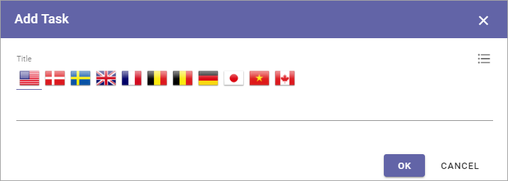

The Tasks tab - authoring processes
======================================

Here you can create a To Do list for the process or process step.

.. image:: processes-tasks-tab.png

To add a task, click ADD TASK, type the text and click OK.

To organize the tasks list, click the pen to edit a link or a heading. Click the dust bin to delete it.

To move a task, drag the icon to the far right to the desired position.

.. image:: pm-tasks-organize.png

To edit a task, click the pen, to delete it, click the dust bin.

Assigning tasks to colleagues
*******************************
In Omnia 6.12 it can be possible to assign tasks to colleagues using Microsoft Planner, if the process is being accessed through Microsoft Teams. A layout for use with  Teams must be created for this purpose.

