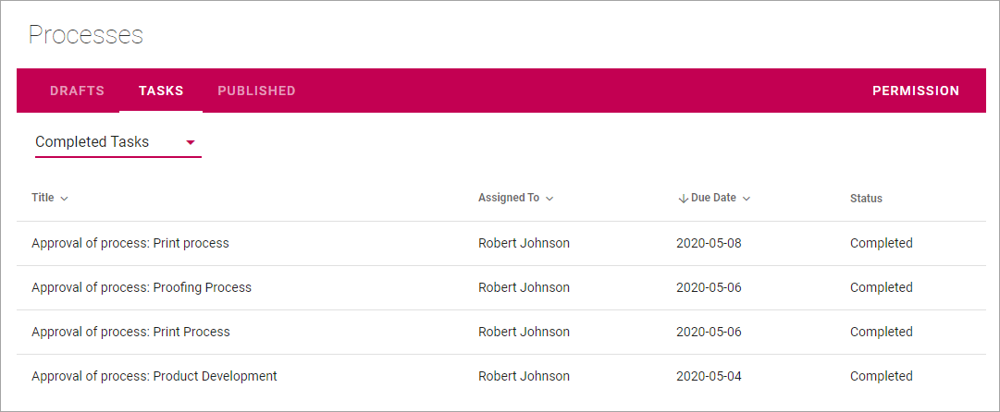

Working with tasks when authoring processes
==============================================

**This documentation is just started. More will be added soon.**

Using the Tasks tab you can see three different lists:

.. image:: pm-tasks-options.png

Assigned To Me
***************
As it says, this list displays all tasks that have been assigned to you. 

(image to be added)

To work with a task, just click the Title, and then something like the following is shown:

(Image to be added)

You can click the link to preview the process. To see additional information about the process, click the i-icon. Here's an example of process information:

(Image to be added)

To go back to the list, click "Cancel".

Assigned By Me
****************
This list displays all Tasks created, when you sent a process for publication. To check the progress for any of the tasks, click the Title. 

Something like the following is then shown:

.. image:: pm-tasks-assigned-by-me.png

Completed Tasks
****************
As it says, this tab displays a list of completed tasks, for example:

You can see additional information, for example comments, by clicking the Title. Here's a simple example of what can be shown:

.. image:: pm-tasks-completed-message.png
