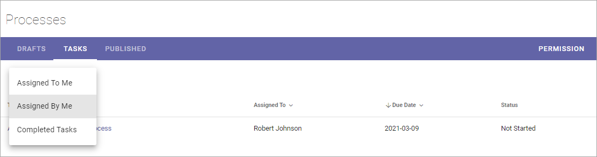
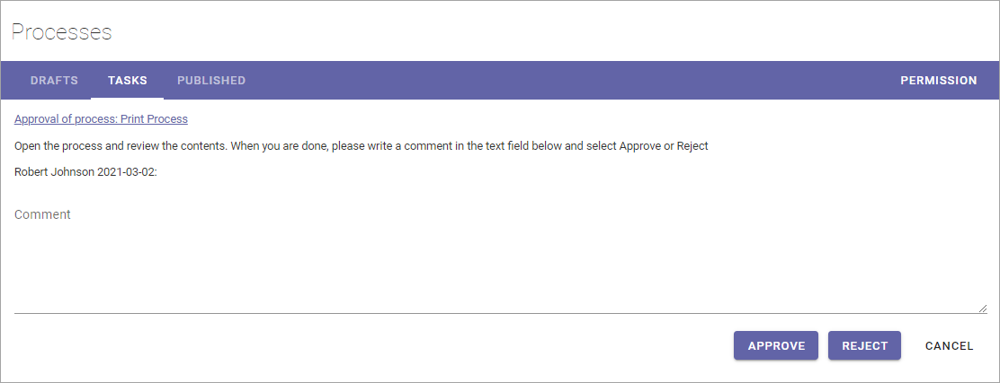
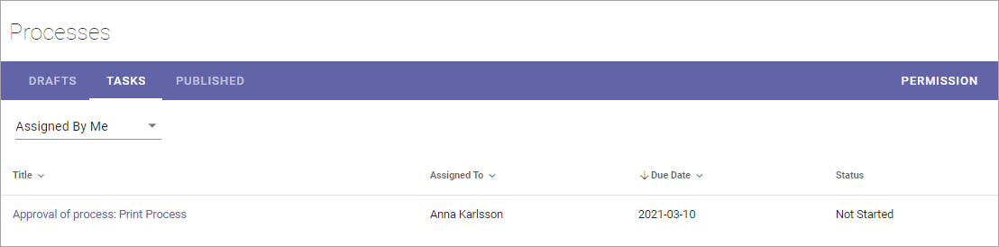
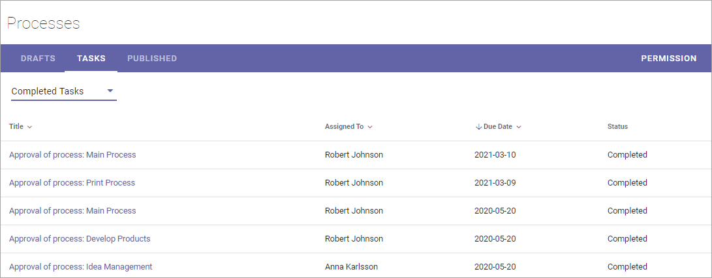
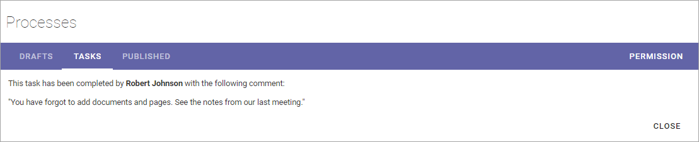

Working with tasks when authoring processes
==============================================

Using the Tasks tab you can see three different lists:

Assigned to me
***************
As it says, this list displays all tasks that have been assigned to you. 

.. image:: pm-tasks-assigned-new.png

To work with a task, just click the title, and then something like the following is shown:

You can click the link to preview the process. 

Approve or reject a process
-----------------------------
When you approve a process for publication, the author receives a notification stating this has been done. 

You approve publication of a process the following way:

1. Click the link to check the process and then close it.
2. Type a message if you want (not mandatory).
3. Click "APPROVE".

If you reject publication for a process, the author receives a notification about that, makes necessary changes and can then publish again, the same way as before. 

You reject publication of the process the following way:

1. Click the link to check the process and then close it.
2. Type a message of what needs to be changed (strictly speaking not mandatory, but something you should normally do).
3. Click "REJECT".

Assigned by m e
****************
This list displays all Tasks created, when you send a process for publication. 

To check the progress for any of the tasks, click the Title. Something like the following is then shown:

.. image:: pm-tasks-assigned-by-me-new.png

Completed tasks
****************
As it says, this tab displays a list of completed tasks, for example:

You can see additional information, for example comments, by clicking the title. Here's a simple example of what can be shown:

