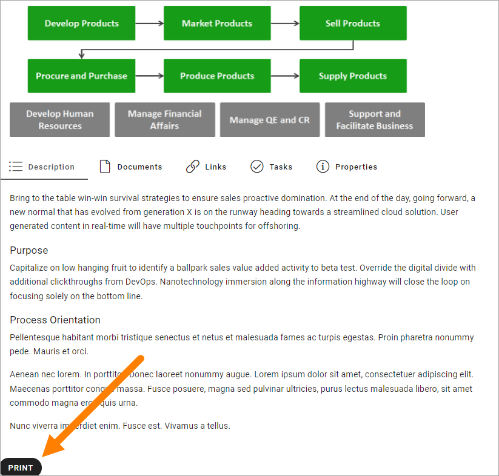
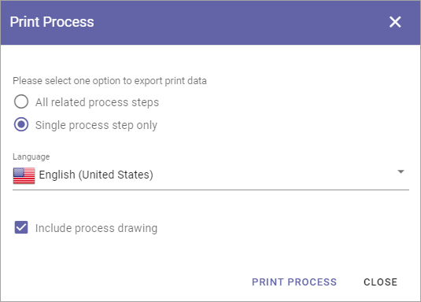

Print a process
=====================================

In Omnia 6.10 and later, it's possible to print a process.

Go to the process you want to print and click the button:

You can choose the following:

As you can see, you can print all related process steps (be careful, it can be a lot), this process only and you can choose to include process drawings(s) in the print. 

When you have chosen what to print, click PRINT PROCESS.

(More information will be added soon).

